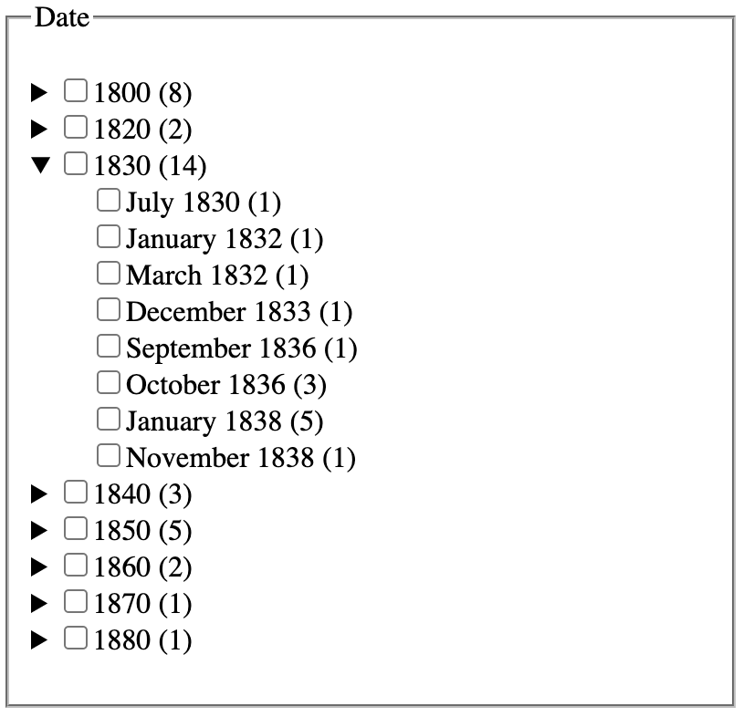
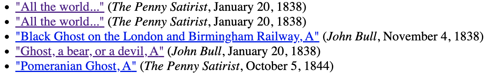
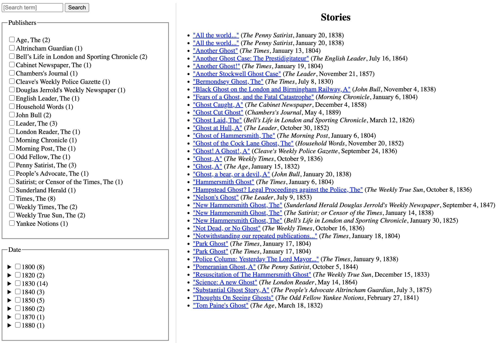

# Facets and fields in eXist-db

## About this document

*Facets* and *fields* are part of the *full-text indexing* feature of eXist-db. As the name implies, full-text indexing provides a mechanism for retrieving documents according to any of the words they contain, e.g., “Find all documents that contain the word ‘ghost’” (anywhere in the document) or “Find all documents that contain the word ‘ghost’ in the title”, etc.

The official eXist-db documentation for full-text indexing is clear, but when we first looked there to begin to learn about facets and fields we found that portion of the documentation too brief to serve as a full and clear introduction to those features. The purpose of this document is to explain why and how to use facets and fields in an eXist-db app, with examples drawn from our Ghost Hoax app. 

The difference between facets and fields is described clearly in Alex Kennedy’s [The definitive guide to the difference between filters and facets](https://www.search.io/blog/the-difference-between-filters-and-facets) (text in square brackets is our own):

> Both exist to serve the same purpose: narrowing down search results by eliminating results or pages that don’t match selected criteria […] For clarity’s sake, we’re going to define them as follows: *filters* [that is, *fields*] exclude results based on **initial criteria and do not change with each search**, while *facets* exclude using the **properties from returned results and do change with each search**.

Louise Vollaire’s [Filters vs. facets for site search](https://www.algolia.com/blog/ux/filters-vs-facets-in-site-search/) further explains that:

>Facets, also known as facet filters, allow users to refine their searches by multiple dimensions at the same time […] Unlike filters, facets change based on the search results returned for a given query. [… A] search for women’s shoes shows facets like color, size, and occasion. But when you search for women’s sunglasses, you see facets like shape and material. “Shape” is not an applicable facet for women’s shoes, and “occasion” is not a relevant facet for sunglasses. Instead, the facets are intelligently applied based on the characteristics of the items returned in the search. 

This tutorial makes the following assumptions:

1. Readers who are not familiar with eXist-db full-text indexing must first read the documentation at <http://exist-db.org/exist/apps/doc/lucene>. 
2. Because facets and fields use maps, a data structure added to XPath only in version 3.1 (2017), users who are not familiar with maps must first read the Saxonica [Maps in XPath](https://www.saxonica.com/html/documentation11/expressions/xpath30maps.html) introduction to maps. More complete official map documentation is available in the [3.11.1.1 Map Constructors](https://www.w3.org/TR/xpath-31/#id-maps) section of the XPath 3.1 specification.

Both facets and fields can index on computed values, which, for reasons described below, can improve response time during query and retrieval. The computation can use the standard XPath and XQuery function libraries, as well as user-defined functions. Below we describe first facets and then fields, including also information about how to import user-defined functions into an index file so that they can be used during configuration.

## Facets

The [eXist-db documentation](http://exist-db.org/exist/apps/doc/lucene.xml?field=all&id=D3.15.73#facets-and-fields) writes that:

> A facet defines a concept or information item by which the indexed items can be grouped. Typical facets would be categories taken from some pre-defined taxonomy, languages, dates, places or names occurring in a text corpus. The goal is to enable users to “drill down” into a potentially large result set by selecting from a list of facets displayed to them. For example, if you shop for a laptop, you are often presented with a list of facets with which you may restrict your result by CPU type, memory or screen size etc. As you select facets, the result set will become smaller and smaller.
> 
> Facets are always pre-defined at indexing time, so the drill down is very fast. They are meant for refining other queries, the assumption always is that the user selects one or more facets from a list of facet values associated with the current query results.

Facets can be configured as hierarchical, about which the eXist-db documentation writes:

> Hierarchical facets may also hold multiple values, for example if we would like to associate our documents with a subject classification on various levels of granularity (say: science with math and physics as subcategories or humanities with art, sociology and history). This way we enable the user to drill down into broad humanities or science subject first and choose particular topics afterwards.

Facets serve two basic purposes in eXist-db: they provide quick and efficient access to counts and they support a relatively simple syntax for compound queries. Any query that uses facets can be rewritten without facets, but where appropriate facets are likely to have two types of advantages:

1. The syntax of queries that use facets may be simpler than an alternative query without facets.
2. Queries that use facets may be more performative than an alternative query without facets.

We say more about those two advantages below.

### Configuring facets

The following eXist-db *collection.xconf* index file constructs a facet for the publisher of a TEI document:

```xml
<collection xmlns="http://exist-db.org/collection-config/1.0" xmlns:tei="http://www.tei-c.org/ns/1.0">
    <index xmlns:xs="http://www.w3.org/2001/XMLSchema">
        <!-- Configure lucene full text index -->
        <lucene>
            <analyzer class="org.apache.lucene.analysis.standard.StandardAnalyzer"/>
            <analyzer id="ws" class="org.apache.lucene.analysis.core.WhitespaceAnalyzer"/>
            <text qname="tei:body"/>
            <text qname="tei:placeName"/>
            <text qname="tei:TEI">
                <facet dimension="publisher" expression="descendant::tei:publicationStmt/tei:publisher"/>
            </text>
        </lucene>
    </index>
</collection>
```

The `<text>` elements in our index file instruct eXist-db to construct full-text indexes for `<body>`, `<placeName>`, and the root `<TEI>` element, and the `<facet>` child of the configuration for the `<TEI>` element says that `<TEI>` elements should be retrievable with a facet called `publisher` (the value of the `@dimension` attribute) that refers to the `<publisher>` child of the `<publicationStmt>` element (the value of the `@expression` attribute). We illustrate below how configuring a facet for the publisher supports query and retrieval operations.

The sample corpus for which we construct the examples below is a collection of Victorian-era newspaper articles about ghost hoaxes.

### Why use facets to count

When we run the following query against our corpus using the facet configuration above:

```xquery
xquery version "3.1";
declare namespace tei="http://www.tei-c.org/ns/1.0";
let $hits as element(tei:TEI)+ := 
    collection('/db/apps/pr-app/data/hoax_xml')/tei:TEI[ft:query(., 'ghost')]
let $facets := ft:facets($hits, "publisher")
return 
    <facet_test>{
        let $facet-elements := 
            map:for-each($facets, function($label, $count) {
                <facet>
                    <label>{$label}</label>
                    <count>{$count}</count>
            </facet>})
        for $facet-element in $facet-elements
        order by $facet-element/count descending,
            $facet-element/label
        return $facet-element
    }</facet_test>
```

it returns a list of all publishers with the numbers of times they occur in the corpus, even though we do not perform any explicit counting in our XQuery code. The output is sorted in descending order by frequency, and then subsorted alphabetically by publisher name:

```xml
<facet_test>
    <facet>
        <label>The Times</label>
        <count>8</count>
    </facet>
    <facet>
        <label>The Leader</label>
        <count>3</count>
    </facet>
    <facet>
        <label>The Penny Satirist</label>
        <count>3</count>
    </facet>
    <facet>
        <label>John Bull</label>
        <count>2</count>
    </facet>
    <facet>
        <label>The Age</label>
        <count>2</count>
    </facet>
    <facet>
        <label>Altrincham Guardian</label>
        <count>1</count>
    </facet>
    <facet>
        <label>Bell’s Life in London and Sporting Chronicle</label>
        <count>w</count>
    </facet>
    <facet>
        <label>Chambers's Journal</label>
        <count>1</count>
    </facet>
    <facet>
        <label>Cleave's Weekly Police Gazette</label>
        <count>1</count>
    </facet>
    <facet>
        <label>Douglas Jerrold's Weekly Newspaper</label>
        <count>1</count>
    </facet>
    <facet>
        <label>Household Words</label>
        <count>1</count>
    </facet>
    <facet>
        <label>Morning Chronicle</label>
        <count>1</count>
    </facet>
    <facet>
        <label>Sunderland Herald</label>
        <count>1</count>
    </facet>
    <facet>
        <label>The Cabinet Newspaper</label>
        <count>1</count>
    </facet>
    <facet>
        <label>The English Leader</label>
        <count>1</count>
    </facet>
    <facet>
        <label>The London Reader</label>
        <count>1</count>
    </facet>
    <facet>
        <label>The Morning Post</label>
        <count>1</count>
    </facet>
    <facet>
        <label>The Odd Fellow</label>
        <count>1</count>
    </facet>
    <facet>
        <label>The People’s Advocate</label>
        <count>1</count>
    </facet>
    <facet>
        <label>The Satirist; or Censor of the Times</label>
        <count>1</count>
    </facet>
    <facet>
        <label>The Weekly Times</label>
        <count>2</count>
    </facet>
    <facet>
        <label>Weekly True Sun</label>
        <count>1</count>
    </facet>
    <facet>
        <label>Yankee Notions</label>
        <count>1</count>
    </facet>
</facet_test>
```

----

**Note:** In our app we move definite and indefinite articles in publisher names to the end for both sorting and retrieval, so that, for example, “The Weekly Times” becomes “Weekly Times, The” and sorts with titles that begin with “w“. We illustrate below how we enhance our facet configuration to perform this modification at index time, which avoids the repeated performance cost that would come with doing it at query time.

----

We could have written the following regular FLWOR expression to return essentially the same results:

```xquery
xquery version "3.1";
declare namespace tei="http://www.tei-c.org/ns/1.0";
let $hits as element(tei:TEI)+ := 
    collection('/db/apps/pr-app/data/hoax_xml')/tei:TEI[ft:query(., 'ghost')]
return 
    <facet_test>{
        for $hit in $hits
        group by $publisher := $hit//tei:publicationStmt/tei:publisher[1]
        let $count := count($hit)
        order by $count descending, $publisher
        return <facet>
            <label>{$publisher ! string(.)}</label>
            <count>{$count}</count>
        </facet>
    }</facet_test>
```

One reason to prefer facets to the regular XQuery FLWOR strategy is that with facets the counts are computed at index time, while with FLWOR they are computed at query time. With a small amount of data the difference will not be noticeable, but computing counts at index time has the same performance advantage as indexing in general: a precomputed value is computed only once and in a context where performance is not critical, and the result can then be retrieved quickly because it does not have to be recomputed each time it is needed.

----

**Note:** XQuery FLWOR expressions since version 3.0 support a <code>count</code> clause that can be used for counting members of a group, but that feature is not supported by eXist-db.

----

Here’s how the facet strategy works:

We can ask about facets in our XQuery only if we first perform a full-text query using `ft:query()`. In the example below we ask for all documents that contain the word ‘ghost’ anywhere at all (metadata or main content). Since our index (above) constructs a full-text index on the root `<TEI>` element, we can select a collection of all `<TEI>` elements in the corpus and filter it, using `ft:query()` in a predicate, to keep only those that contain the string ‘ghost’. We bind the result of this query to a variable we call `$hits`.

----

**Note:** If we want to retrieve all documents without filtering on string content, we can use:
```xquery
collection('/db/apps/pr-app/data/hoax_xml')/tei:TEI[ft:query(., ())]
```
with an empty sequence as the second argument to the `ft:query()` function.

**Note:** Because of the way that eXist-db indexed retrieval works, we must specify the documents and the predicate in the same statement. For example, the XPath in the snippet below is informationally identical to that of the first version, above, and also easier to read because it uses <dfn>convenience variables</dfn>. Unfortunately, it will not quickly or reliably produce correct results in eXist-db because it selects the documents on one line and applies the predicate on a different line:

```xquery
(: bad code :)
let $articles as element(tei:TEI)+ := 
    collection('/db/apps/pr-app/data/hoax_xml')/tei:TEI
let $hits as element(tei:TEI)+ := 
    $articles[ft:query(., 'ghost')]
```

----

Once we have bound the variable `$hits` to the `<TEI>` elements in our corpus that contain the string ‘ghost’ we then use the `ft:facets()` function to return the publisher names with their article counts. Note that *we do no explicit counting in our FLWOR*; the counts are created at index time and are available without having to count at query time. The first argument to the function `ft:facets()` is the result of `ft:query()` (in this case the `$hits` variable), the second argument is the name of the `@dimension` we declared for the `publisher` facet in the index (in this case the string `"publisher"`), and the third argument (which is optional) is the maximum number of results to return (we omit this argument to return all hits).

The `ft:facets()` function returns a *map*, which is a structure that contains *key:value* pairs. In this case the *keys* are the string values of each unique `<publisher>` element in the corpus and the associated *values* in the map are the numbers of documents that have each specific publisher. Maps cannot easily be serialized (rendered, printed) directly, and we want to convert the map structure into XML anyway. Furthermore, the entries in the map returned by `ft:facets()` are automatically sorted from highest to lowest counts, which is part of what we want, but the keys with the same count come back in an unpredictable order, and we want to alphabetize them in our output, which means that we need to sort them ourselves. We address these requirements by converting the map to a sequence of XML elements and then sorting the elements, as follows:

1. Use the `map:for-each()` function to loop over the *key: value* pairs.
2. For each *key: value* pair, bind the key (the name of the publisher) to the variable name `$label` and the value (the number of times that publisher appears in the collection of documents represented by `$hits`) to the variable name `$count`. 
3. Create an XML `<facet>` element (you can call it whatever you want) with two children and write the label and count values into the children.
4. Bind that sequence of `<facet>` elements to a variable called `$facet-elements` and use a FLWOR to traverse over the values (`for`), sort them the way we want (`order by`), and output them in the new order.

### Computed values

The facet example above uses the value of the publisher as it appears in the XML source files, but we actually want to sort and render the publisher names in a list with definite and indefinite articles moved to the end. For example, we want a publisher name like “The Weekly Times” to be sorted and rendered as “Weekly Times, The”. Facets let us perform that operation at index time, instead of query time, which means that we perform it only once, and at a time when performance speed is less important.

We can use an inline XPath expression to create a computed facet value, but the XPath to perform the operation we want is long enough that inlining it would make our index file difficult to read. For that reason we create the function in a separate function library, which we then import into our *collection.xconf* index file. The function that moves the definite and indefinite articles around is:

```xquery
declare function hoax:format-title($title as xs:string) as xs:string {
    if (matches($title, '^(The|An|A) '))
        then replace($title, '^(The|An|A)( )(.+)', '$3, $1')
            ! concat(upper-case(substring(., 1, 1)), substring(., 2))
        else $title
};
```

This matches a leading definite or indefinite article and moves it to the end after a comma and a space. Because we have titles like “A ghost, a bear, or a devil” we also need to ensure that the first character of the title will be capitalized after the rearrangement.

This function is part of a function library located at *modules/index-functions.xqm* inside our app. We import it into our index file with:

```xml
<module uri="http://obdurodon.org/hoax" prefix="hoax" at="modules/index-functions.xqm"/>
```

(the path is relative to the root directory of the app) and use it during indexing by changing our facet definition to:

```xml
<facet dimension="publisher"
    expression="descendant::tei:publicationStmt/tei:publisher 
    ! hoax:format-title(.)"/>
```

This says that the string that will be returned as the name of the facet with a dimension value of `"publisher"` will be constructed by applying our user-defined function to the name of the publisher as it appears in our source documents. After we retrieve and style our publisher facets that portion of our page looks like:


### Hierarchical facets

The eXist-db facet documentation illustrates a hierarchical facet with an example that divides an ISO date (e.g., `1806-02-04`) into a hierarchy of year, then month, and then day. A user could filter first by years and then filter the results for each year by month, and then filter those by day. Our requirements were more complex because we wanted to use a computed decade as our top-level date facet and a computed human-readable month + year as a second level. The rendered view, with one of the decade facets expanded, looks like:



Although we need to render our month + year combinations in human-readable form, we want to sort them in ISO order. For that reason we create a second-level facet (with decades as the first level) based on just the year and month of an ISO date (e.g., `1806-02`). That lets us group, count, retrieve, and sort our results, and we then convert the value to a human-readable form for rendering.

----

**Note:** A string like `1806-02` does not match a valid ISO date because it is missing the required day portion, which means that it is not acceptable input to the XPath `format-date()` function. At the same time, we want to group our documents for facet purposes by just year and month, so we don’t want to include the day in the facet value. We meet those requirements by using just the `1806-02` portion of the date as the second-level facet value (so that all articles from the same month of the same year are grouped and counted together) and then appending `-01` to each value before passing it into `format-date()` with a picture string of `"[MNn] [Y]"` for rendering. Adding a fake day maps the facet value onto a valid ISO date that is correct for our purposes, and our picture string then ignores the day component and outputs only the month and year.

----

The portion of our index file that constructs the date facets is:

```xml
<facet dimension="publication-date"
    expression="descendant::tei:publicationStmt/tei:date/@when
        ! (
            (substring(., 1, 3) || '0'), 
            substring(., 1, 7)
        )" hierarchical="yes"/>
```

Hierarchical facets are created by specifying the value of a `@hierarchical` attribute as `"yes"` and specifying a sequence of values for the `@expression` attribute. In this case our XPath expression will, for example, map a date like `1806-02-04` to the sequence `('1800', '1806-02')` The first value is the top-level facet, the decade, and the second will be transformed to `"February 1806"` for rendering.

----

**Note:** We need to return the facet value as a truncated ISO date, rather than the human-readable month + year, because we need to sort the results and only the ISO dates will sort correctly. Once we have performed the sorting we can then transform the truncated ISO date into a human-readable equivalent.

----

The XQuery that returns the faceted results (before formatting) looks like:

```xquery
let $publication-date-facets as map(*) := ft:facets($hits, "publication-date", ())
let $publication-date-elements := 
    map:for-each($publication-date-facets, function($decade, $count) {
        <m:decade>
            <m:label>{$decade}</m:label>
            <m:count>{$count}</m:count>
            <m:years>{
                let $year-facets as map(*) := ft:facets($hits, "publication-date", (), $decade)
                let $year-elements :=
                    map:for-each($year-facets, function($m-label, $m-count) {
                        <m:year>
                            <m:label>{$m-label}</m:label>
                            <m:count>{$m-count}</m:count>
                        </m:year>
                    })
                for $year-element in $year-elements
                order by $year-element
                return $year-element
            }</m:years>                    
    </m:decade>})
for $publication-date-element in $publication-date-elements
order by $publication-date-element/m:label
return $publication-date-element
```

This returns:

```xml
<m:decade>
    <m:label>1800</m:label>
    <m:count>8</m:count>
    <m:years>
        <m:year>
            <m:label>1804-01</m:label>
            <m:count>8</m:count>
        </m:year>
    </m:years>
</m:decade>
<m:decade>
    <m:label>1820</m:label>
    <m:count>2</m:count>
    <m:years>
        <m:year>
            <m:label>1825-01</m:label>
            <m:count>1</m:count>
        </m:year>
        <m:year>
            <m:label>1826-03</m:label>
            <m:count>1</m:count>
        </m:year>
    </m:years>
</m:decade>
<m:decade>
    <m:label>1830</m:label>
    <m:count>14</m:count>
    <m:years>
        <m:year>
            <m:label>1830-07</m:label>
            <m:count>1</m:count>
        </m:year>
        <m:year>
            <m:label>1832-01</m:label>
            <m:count>1</m:count>
        </m:year>
        <m:year>
            <m:label>1832-03</m:label>
            <m:count>1</m:count>
        </m:year>
        <m:year>
            <m:label>1833-12</m:label>
            <m:count>1</m:count>
        </m:year>
        <m:year>
            <m:label>1836-09</m:label>
            <m:count>1</m:count>
        </m:year>
        <m:year>
            <m:label>1836-10</m:label>
            <m:count>3</m:count>
        </m:year>
        <m:year>
            <m:label>1838-01</m:label>
            <m:count>5</m:count>
        </m:year>
        <m:year>
            <m:label>1838-11</m:label>
            <m:count>1</m:count>
        </m:year>
    </m:years>
</m:decade>
<m:decade>
    <m:label>1840</m:label>
    <m:count>3</m:count>
    <m:years>
        <m:year>
            <m:label>1841-02</m:label>
            <m:count>1</m:count>
        </m:year>
        <m:year>
            <m:label>1844-10</m:label>
            <m:count>1</m:count>
        </m:year>
        <m:year>
            <m:label>1847-09</m:label>
            <m:count>1</m:count>
        </m:year>
    </m:years>
</m:decade>
<m:decade>
    <m:label>1850</m:label>
    <m:count>5</m:count>
    <m:years>
        <m:year>
            <m:label>1852-10</m:label>
            <m:count>1</m:count>
        </m:year>
        <m:year>
            <m:label>1852-11</m:label>
            <m:count>1</m:count>
        </m:year>
        <m:year>
            <m:label>1853-07</m:label>
            <m:count>1</m:count>
        </m:year>
        <m:year>
            <m:label>1857-11</m:label>
            <m:count>1</m:count>
        </m:year>
        <m:year>
            <m:label>1858-12</m:label>
            <m:count>1</m:count>
        </m:year>
    </m:years>
</m:decade>
<m:decade>
    <m:label>1860</m:label>
    <m:count>2</m:count>
    <m:years>
        <m:year>
            <m:label>1864-05</m:label>
            <m:count>1</m:count>
        </m:year>
        <m:year>
            <m:label>1864-07</m:label>
            <m:count>1</m:count>
        </m:year>
    </m:years>
</m:decade>
<m:decade>
    <m:label>1870</m:label>
    <m:count>1</m:count>
    <m:years>
        <m:year>
            <m:label>1875-07</m:label>
            <m:count>1</m:count>
        </m:year>
    </m:years>
</m:decade>
<m:decade>
    <m:label>1880</m:label>
    <m:count>1</m:count>
    <m:years>
        <m:year>
            <m:label>1889-05</m:label>
            <m:count>1</m:count>
        </m:year>
    </m:years>
</m:decade>
```

The decade beginning in 1810 is missing because there are no articles in the corpus from that decade. Facets never return keys for which the count is zero, so if we want to list all decades, including those with no articles, we need to anticipate and handle any missing decades ourselves.

### Facets and boolean queries

Faceting searching supports `and` and `or` combinations in an intuitive and efficient way. For example, when we ask for a specific combination of `publisher` and `decade` facet values above, we retrieve only records that match both values, which is an `and` operation, e.g., articles that satisfy both 1) the condition of having been published in *The Times* **and** 2) the condition of having been published in the 1800s. We can also perform an `or` operation, e.g., all articles that satisfy all the conditions of 1) containing the word ‘ghost’, **and** 2) having been published in the 1830s, **and** 3) having been published either in *The Times* **or** in *The Penny Satirist*. That type of query might look like:

```xquery
xquery version "3.1";
declare namespace tei="http://www.tei-c.org/ns/1.0";
let $hits  as element(tei:TEI)+ := 
    collection('/db/apps/pr-app/data/hoax_xml')/tei:TEI[ft:query(
        ., 
        (),
        map {
            "facets": map {
                "publisher" : ("Times, The", "Penny Satirist, The"),
                "publication-date" : "1830"
            }
        })]
for $hit in $hits
let $title as element(tei:title) := $hit//tei:titleStmt/tei:title
let $publisher as element(tei:publisher) := $hit//tei:publicationStmt/tei:publisher
let $date as xs:string := $hit//tei:publicationStmt/tei:date/@when
    ! format-date(., '[MNn] [D], [Y]')
return
    <li>{string-join(($title, $publisher, $date), '; ')}</li>
```

That query returns:

```xml
<li>All the world...; The Penny Satirist; January 20, 1838</li>
<li>The Bermondsey Ghost; The Times; July 8, 1830</li>
<li>Police Column: Yesterday The Lord Mayor...; The Times; January 9, 1838</li>
<li>All the world...; The Penny Satirist; January 20, 1838</li>
```

----

**Note:** In the example above we incorporate a call fo the XPath `format-date()` function in our XQuery. We illustrate below how to improve performance by using an eXist-db field to create the formatted date at index time, which avoids the processing overhead of running it (repeatedly) at query time.

----

It is possible to construct a query that returns the same results without facets, but there are at least two reasons we might prefer using facets:

1. Once we become accustomed to the syntax of the third argument to the `ft:query()` function, it can be simpler (easier to read, less error-prone) than constructing predicates because the facet functionality understands where to use `and` and where to use `or`.
2. Complex predicates in eXist-db require care because not all types of combinations are able to use indexing to optimize retrieval.

### Facets conclusion

The primary benefits of using facets are:

1. *Facets provide counts* of the number of matches for each key value and those counts are computed at index time. This is a unique feature; obtaining these counts without facets requires counting at query time, which is less efficient.
2. *Facets provide intuitive support for compound queries.* This functionality, including indexed retrieval, can be implemented without facets by using range indexes and queries that are attentive to what eXist-db can and cannot optimize. Once we familiarized ourselves with using maps, though, we found the facet approach easier to understand and less prone to error.
3. *Facets provide intuitive support for hierarchical structures.* This functionality can also be implemented without facets, but the facet approach performs any string surgery (in this case isolating the year and month from the full ISO date) during indexing, instead of at query time. This means that it is performed only once, and in a context that is typically less time-critical than interactive search and retrieval.

## Fields

The [eXist-db documentation](http://exist-db.org/exist/apps/doc/lucene.xml?field=all&id=D3.15.73#facets-and-fields) writes that:

> A field contains additional, searchable content attached to an indexed parent node. In many cases fields will contain constructed content which is not directly found in the indexed XML or requires costly computation. For example, determining publication dates or author names for a set of articles may require some pre-processing which may be too expensive at query time. A field allows you to pre-compute those information items at indexing time.
> 
> Fields can be queried in the same expression as the parent node, resulting in fast response times. Their content can optionally be stored to speed up display or sorting. Fields may also use a different analyzer than the parent node, which allows e.g. multiple languages to be handled separately.

Fields differ from facets with respect to their functionality and their use. The eXist-db documentation describes several contexts in which fields may be useful, but the one we focus on here is that fields, like facets, can hold precomputed values. The benefit of storing precomputed values in fields is that the computation is performed only once, and at indexing time, while otherwise it would have to performed at query time, and therefore separately for each query. Furthermore, indexing is typically less time-sensitive than query and retrieval, which means that using fields has the potential of improving query response time.

In our project we want to render a full formatted date for each article. For example, when our search returns a sequence of article information that will serve as clickable links for retrieval, we want output that looks like:



The article titles and newspaper titles can be retrieved verbatim from the XML sources, but the date information is present only in ISO format. We could format it as part of our query, but we’ll get faster responses at query time if we perform that sort of manipulation ahead of time, when indexing. We choose fields, rather than facets, for this task because we don’t need to group and count by complete dates and we don’t need a hierarchy; all we need is to preconstruct a string value and retrieve it (instead of computing it) at query time.

# RESUME HERE
### Configuring fields

The simplest way to configure a field is to add a `<field>` element to the index file, as in:

```xml
<collection xmlns="http://exist-db.org/collection-config/1.0" xmlns:tei="http://www.tei-c.org/ns/1.0">
  <index xmlns:xs="http://www.w3.org/2001/XMLSchema">
    <!-- Configure lucene full text index -->
    <lucene>
      <analyzer class="org.apache.lucene.analysis.standard.StandardAnalyzer"/>
      <analyzer id="ws" class="org.apache.lucene.analysis.core.WhitespaceAnalyzer"/>
      <text qname="tei:body"/>
      <text qname="tei:placeName"/>
      <text qname="tei:TEI">
        <field name="publisher-disartictulated" 
          expression="descendant::tei:publicationStmt/tei:publisher
            ! analyze-string(., '^(The|An|A) (.+)')/*
            ! (if (. instance of element(fn:match)) then 
                concat(fn:group[@nr eq '2'], ', ', fn:group[@nr eq '1'])
              else .
                )"/>
      </text>
    </lucene>
  </index>
</collection>
```

The preceding field specification creates a field called `publisher-disarticulated` that removes a leading article from the beginning of a publisher name and moves it to the end after a comma and a space. For example, if the publisher is “The TimesÍ” the value of the corresponding`publisher-disarticulated` field is “Times, The”. We could perform this string surgery at query time, but implementing it instead at indexing time means that it has to be performed only once and that the value is available on demand, without having to be generated afresh. We can use a computed field value for either query or rendering, that is, either our query can ask for records with a `publisher-disarticulated` value of “Times, The” or we can select records in another way and render the publisher name as “Times, The” instead of the original “The Times”. (For information about the XPath `analyze-string()` function used above see the [5.6.6 fn:analyze-string](https://www.w3.org/TR/xpath-functions-31/#func-analyze-string) section of the W3C [XPath and XQuery Functions and Operators 3.1](https://www.w3.org/TR/xpath-functions-31/) documentation.)


**GIVE AN EXAMPLE**

# TODO: ODDS AND ENDS

### Incremental faceted searching

The [eXist-db documentation](http://exist-db.org/exist/apps/doc/lucene.xml?field=all&id=D3.19#refine-facets) writes that:

> The main purpose of facets is to quickly narrow down a query result, limiting it to only items which match a certain facet value. 

This means that, for example, facets can provide an efficient way to retrieve resources according to different combinations of values, such as, in our case, combinations of publishers and decades. 

The following *collection.xconf* file creates facets for `publisher` and `decade`, using a computed value to construct the decade by taking the first three digits of the publication year (at the beginning of the `@when` attribute on the `<date>` child of the `<publicationStmt>`) and appending a zero:

```xml
<collection xmlns="http://exist-db.org/collection-config/1.0" xmlns:tei="http://www.tei-c.org/ns/1.0">
    <index xmlns:xs="http://www.w3.org/2001/XMLSchema">
        <lucene>
            <analyzer class="org.apache.lucene.analysis.standard.StandardAnalyzer"/>
            <analyzer id="ws" class="org.apache.lucene.analysis.core.WhitespaceAnalyzer"/>
            <text qname="tei:body"/>
            <text qname="tei:placeName"/>
            <text qname="tei:TEI">
                <!-- publisher -->
                <facet dimension="publisher" expression="descendant::tei:publicationStmt/tei:publisher"/>
                <!-- decade: constructed value, relies on date/@when beginning with a year -->
                <facet dimension="decade" expression="
                    descendant::tei:publicationStmt/tei:date/@when 
                    ! substring(., 1, 3)
                    || '0'"/>
            </text>
        </lucene>
    </index>
</collection>
```

The following XQuery returns documents containing the word ‘ghost’ that were published in any of the three best-represented publications, allowing the `publisher` facet (which knows the counts) to tell us what those three are:

```xquery
xquery version "3.1";
declare namespace tei="http://www.tei-c.org/ns/1.0";
<facets>{
    let $hits  as element(tei:TEI)+ := collection('/db/apps/pr-app/data/hoax_xml')/tei:TEI[ft:query(., 'ghost')]
    let $pub-facets as map(*) := ft:facets($hits, "publisher", 3)
    for $publisher in map:keys($pub-facets)
    return
        <publisher>
            <name>{$publisher}</name>
            {
                let $articles-by-publisher as element(tei:TEI)* := 
                    collection('/db/apps/pr-app/data/hoax_xml')/tei:TEI[ft:query(
                        .,
                        'ghost',
                        map {
                            "facets" : map {
                                "publisher" : $publisher
                            }
                        }
                    )]
                let $decade-facets as map(*) := ft:facets($articles-by-publisher, "decade")
                let $decade-data as element(facet)+ := map:for-each(
                    $decade-facets, 
                    function ($decade, $count) {
                        <facet>
                            <decade>{$decade}</decade>
                            <count>{$count}</count>
                        </facet>
                    }
                )
                for $facet in $decade-data
                order by $facet/decade, $facet/count descending
                return $facet
            }
        </publisher>
}</facets>
```

The preceding XQuery returns:

```xml
<facets>
    <publisher>
        <name>The Times</name>
        <facet>
            <decade>1800</decade>
            <count>6</count>
        </facet>
        <facet>
            <decade>1830</decade>
            <count>2</count>
        </facet>
    </publisher>
    <publisher>
        <name>The Leader</name>
        <facet>
            <decade>1850</decade>
            <count>3</count>
        </facet>
    </publisher>
    <publisher>
        <name>The Penny Satirist</name>
        <facet>
            <decade>1830</decade>
            <count>2</count>
        </facet>
        <facet>
            <decade>1840</decade>
            <count>1</count>
        </facet>
    </publisher>
</facets>
```

Here is how it works:

1. We start by finding all documents in the corpus that contain the word ‘ghost’, and we bind that sequence to the variable `$hits`.
2. We next use the `ft:facets()` function to find the three most represented publishers and return a map that uses their names as keys and the number of articles they published as values. We do not perform any explicit counting in our FLWOR; the facet already knows the counts and knows how to return a specified number of highest values. We bind this map to the variable `$pub-facets`.
3. We next iterate over each of the three publishers (which we retrieve with the `map:keys()` function) and create a `<publisher>` element in the output for each of them. We write the name of the publisher into a `<name>` child of the output `<publisher>` element.
4. We next construct a query that retrieves the articles that contain ‘ghost’ that are by the specific publisher we are looking at at the moment. We use the `ft:query()` function to do this, specifying in our third argument to that function that we want to retrieve only results that match the specific `publisher` facet value for that pass through the loop. We bind that sequence of documents to a variable called `$articles-by-publisher`.
5. For each sequence of publisher-specific articles we use the `ft:facets()` function to find all of the decades in which that publisher published a story that contained the word ‘ghost’. We return that result as a map, which we bind to the variable `$decade-facets`. 
6. Within the `$decade-facets` map the decade identifier is the key and the number of articles in that decade is the value. We transform the map into XML in the same way as we did above, sort the map entries by decade, and return the results as XML.

In the context of an app we might want to include the actual article titles, formatted as links that can be used to retrieve a reading view of a specific article. The following modification of our code returns HTML that could serve as the starting point for this type of view (to simplify the code we omit the linking, the details of which would depend on the app-specific API):

```xquery
xquery version "3.1";
declare namespace tei="http://www.tei-c.org/ns/1.0";
(: all articles with ‘ghost’ :)
let $hits  as element(tei:TEI)+ := 
    collection('/db/apps/pr-app/data/hoax_xml')/tei:TEI[ft:query(., 'ghost')]
(: top three publisher names and article counts :)
let $pub-facets as map(*) := ft:facets($hits, "publisher", 3)
for $publisher in map:keys($pub-facets)
(: articles for individual publisher :)
let $publisher-articles as element(tei:TEI)+ := 
    collection('/db/apps/pr-app/data/hoax_xml')/tei:TEI[ft:query(., 'ghost',
    map { 
        "facets" : map { 
            "publisher" : $publisher
        }
    })]
(: decades for each publisher, with article counts :)
let $publisher-decades as map(*) := ft:facets($publisher-articles, "decade")
return
    (<h2>{$publisher} ({$pub-facets($publisher)})</h2>,
    <ul>{
        for $decade in map:keys($publisher-decades)
        (: articles for publisher-decade combination :)
        let $publisher-articles-by-decade as element(tei:TEI)+ :=
            collection('/db/apps/pr-app/data/hoax_xml')/tei:TEI[ft:query(., 'ghost',
            map { 
                "facets" : map { 
                    "publisher" : $publisher,
                    "decade" : $decade
                }
            })]
        order by $decade
        return <li>{$decade || 's'} ({$publisher-decades($decade)})
            <ul>{
                for $article as element(tei:TEI) in $publisher-articles-by-decade
                let $title as element(tei:title) := $article//tei:titleStmt/tei:title
                order by $title
                return 
                    <li>{$title ! string(.)}</li>
            }</ul>
        </li>
    }</ul>)
```

The formatted HTML output looks like:



Some of the titles are duplicates because multiple articles were published under the same titles, but each entry corresponds to a different document in the corpus.

----
## Faceted search organization

Three components: *text*, *publisher*, *date*. All three function equivalently, as facets, to drill down into full corpus. That is, any can be modified at any time to refine a previous search step. (This is not a traditional use of full-text searching.)
### Text

Single word form, retrieved with Lucene full-text index defined for entire document (TODO: or just `<text>` portion?). Only a single word is supported.

### Publisher

Name of publisher, with definite and indefinite article moved to end (e.g., “Times, The” instead of “The Times”.)

### Date

Hierarchical, with *decade* at top level and *month-year* in human-readable form (e.g., “January 1804”) as second level. Second level is returned as `YYYY-MM` to support sorting and then formatted as part of the view.

1. Checking the decade implicitly selects all of its subcategories, which are automatically checked.
2. Unchecking the decade unchecks all of its subcategories.
3. Checking the last month-year causes the decade to be checked.
4. Unchecking a month-year when some were previously selected causes the decade to be unchecked, and rendered as a dash in the checkbox, as long as one month-year is still checked.
5. Unchecking the last month-year child causes the decade to be unchecked, with no dash rendered.
### Implementation

1. Categories (*publisher*, *date*) are multi-select; multiple selections within a category form an `or` operation.
2. Facet categories combinations (`text`, `publisher`, `date`) form an `and` operation.
3. Update only when **Search** button is pressed (do not update automatically on each check).
4. Each query maintains state by sending the current selections to the server, which returns both a full, unfaceted retrieval (except for keyword, which is always applied) and a faceted result. Those are both included in the model and reconciled in the view. Specifically, the model includes a) all content, b) filtered content, and c) metadata, which contains selected publishers, decades and month-years.
