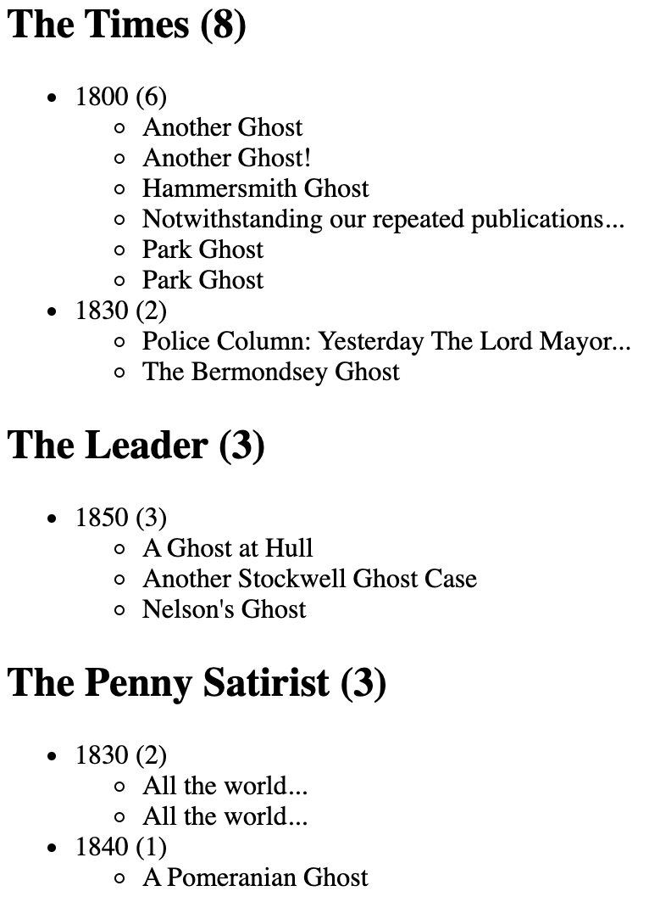

# Facets and fields in eXist-db

## About this document

*Facets* and *fields* are part of the *full-text indexing* feature of eXist-db. As the name implies, full-text indexing provides a mechanism for retrieving documents according to any of the words they contain, e.g., “Find all documents that contain the word ‘ghost’” (anywhere in the document) or “Find all documents that contain the word ‘ghost’ in the title”, etc.

The official eXist-db documentation for full-text indexing is clear, but when we first looked there to begin to learn about facets and fields we found that portion of the documentation too brief to serve as a clear introduction to those features. The purpose of this document is to provide simple examples of why and how to use facets and fields in an eXist-db app. 

Assumptions:

1. Readers who are not familiar with eXist-db full-text indexing should first read the documentation at <http://exist-db.org/exist/apps/doc/lucene>. 
2. Because facets and fields use maps, a data structure added to XPath only in version 3.1 (2017), users who are not familiar with maps should first read the Saxonica [Maps in XPath](https://www.saxonica.com/html/documentation11/expressions/xpath30maps.html) introduction to maps. More complete official map documentation is available in the [3.11.1.1 Map Constructors](https://www.w3.org/TR/xpath-31/#id-maps) section of the XPath 3.1 specification.

## Facets

Facets serve two basic purposes in eXist-db: they provide quick and efficient access to counts and the support a relatively simple syntax for compound queries. Any query that uses facets can be rewritten without facets, but where appropriate facets are likely to have two types of advantages:

1. The syntax of queries that use facets may be simpler than an alternative query without facets.
2. Queries that use facets may be more performative than an alternative query without facets.

We say more about those two advantages below.

### Configuring facets

The following eXist-db *collection.xconf* index file constructs a facet for the publisher of a TEI document:

```xml
<collection xmlns="http://exist-db.org/collection-config/1.0" xmlns:tei="http://www.tei-c.org/ns/1.0">
    <index xmlns:xs="http://www.w3.org/2001/XMLSchema">
        <!-- Configure lucene full text index -->
        <lucene>
            <analyzer class="org.apache.lucene.analysis.standard.StandardAnalyzer"/>
            <analyzer id="ws" class="org.apache.lucene.analysis.core.WhitespaceAnalyzer"/>
            <text qname="tei:body"/>
            <text qname="tei:placeName"/>
            <text qname="tei:TEI">
                <facet dimension="publisher" expression="descendant::tei:publicationStmt/tei:publisher"/>
            </text>
        </lucene>
    </index>
</collection>%
```

The `<text>` elements in our index file instruct eXist-db to construct full-text indexes for `<body>`, `<placeName>`, and the root `<TEI>` element, and the `<facet>` child of the configuration for the `<TEI>` element says that `<TEI>` elements should be retrievable with a facet called `publisher` (the value of the `@dimension` attribute) that refers to the `<publisher>` child of the `<publicationStmt>` element. We illustrate below how configuring a facet for the publisher supports query and retrieval operations.

The sample corpus for which we construct the examples below is a collection of Victorian-era newspaper articles about ghost hoaxes.

### Why use facets to count

When we run the following query against our corpus:

```xquery
xquery version "3.1";
declare namespace tei="http://www.tei-c.org/ns/1.0";
let $hits as element(tei:TEI)+ := 
    collection('/db/apps/pr-app/data/hoax_xml')/tei:TEI[ft:query(., 'ghost')]
let $facets := ft:facets($hits, "publisher", 100)
return 
    <facet_test>{
        let $facet-elements := 
            map:for-each($facets, function($label, $count) {
                <facet>
                    <label>{$label}</label>
                    <count>{$count}</count>
            </facet>})
        for $facet-element in $facet-elements
        order by $facet-element/count descending,
            $facet-element/label
        return $facet-element
    }</facet_test>
```

it returns a list of all publishers with the numbers of times their publications occur in the corpus, even though we do not perform any explicit counting in our XQuery code. The output is sorted in descending order by frequency, and then subsorted alphabetically by publisher name:

```xml
<facet_test>
    <facet>
        <label>The Times</label>
        <count>8</count>
    </facet>
    <facet>
        <label>The Leader</label>
        <count>3</count>
    </facet>
    <facet>
        <label>The Penny Satirist</label>
        <count>3</count>
    </facet>
    <facet>
        <label>John Bull</label>
        <count>2</count>
    </facet>
    <facet>
        <label>The Age</label>
        <count>2</count>
    </facet>
    <facet>
        <label>Altrincham Guardian</label>
        <count>1</count>
    </facet>
    <facet>
        <label>Bell's Life in London and Sporting Chronicle</label>
        <count>1</count>
    </facet>
    <facet>
        <label>Bell’s Life in London and Sporting Chronicle</label>
        <count>1</count>
    </facet>
    <facet>
        <label>Chambers's Journal</label>
        <count>1</count>
    </facet>
    <facet>
        <label>Cleave's Weekly Police Gazette</label>
        <count>1</count>
    </facet>
    <facet>
        <label>Douglas Jerrold's Weekly Newspaper</label>
        <count>1</count>
    </facet>
    <facet>
        <label>Household Words</label>
        <count>1</count>
    </facet>
    <facet>
        <label>Morning Chronicle</label>
        <count>1</count>
    </facet>
    <facet>
        <label>Sunderland Herald</label>
        <count>1</count>
    </facet>
    <facet>
        <label>The Cabinet Newspaper</label>
        <count>1</count>
    </facet>
    <facet>
        <label>The English Leader</label>
        <count>1</count>
    </facet>
    <facet>
        <label>The London Reader</label>
        <count>1</count>
    </facet>
    <facet>
        <label>The Morning Post</label>
        <count>1</count>
    </facet>
    <facet>
        <label>The Odd Fellow</label>
        <count>1</count>
    </facet>
    <facet>
        <label>The People’s Advocate</label>
        <count>1</count>
    </facet>
    <facet>
        <label>The Satirist; or Censor of the Times</label>
        <count>1</count>
    </facet>
    <facet>
        <label>The Weekly Times</label>
        <count>1</count>
    </facet>
    <facet>
        <label>Weekly Times</label>
        <count>1</count>
    </facet>
    <facet>
        <label>Weekly True Sun</label>
        <count>1</count>
    </facet>
    <facet>
        <label>Yankee Notions</label>
        <count>1</count>
    </facet>
</facet_test>
```

**Note:** In Real Life we would move definite and indefinite articles in publisher names to the end for both sorting and retrieval, so that, for example, “The Weekly Times” would become “Weekly Times, The” and would sort with titles that begin with “w“. We omit that step here so that we can simplify the code and keep our focus specifically on facets.

We could have written the following regular FLWOR expression to return essentially the same results:

```xquery
xquery version "3.1";
declare namespace tei="http://www.tei-c.org/ns/1.0";
let $hits as element(tei:TEI)+ := 
    collection('/db/apps/pr-app/data/hoax_xml')/tei:TEI[ft:query(., 'ghost')]
return 
    <facet_test>{
        for $hit in $hits
        group by $publisher := $hit//tei:publicationStmt/tei:publisher[1]
        let $count := count($hit)
        order by $count descending, $publisher
        return <facet>
            <label>{$publisher ! string(.)}</label>
            <count>{$count}</count>
        </facet>
    }</facet_test>
```

One reason to prefer facets to the regular XQuery FLWOR strategy is that with facets the counts are computed at index time, while with FLWOR they are computed at query time. With a small amount of data the difference will not be noticeable, but computing counts at index time has the same performance advantage as indexing in general: a precomputed value is computed only once and in a context where performance is not critical, and the result can then be retrieved quickly because it does not have to be recomputed each time it is needed.

**Note:** XQuery FLWOR expressions since version 3.0 support a <code>count</code> clause that can be used for counting members of a group, but that feature is not supported by eXist-db.

Here’s how the facet strategy works:

We can ask about facets in our XQuery only if we first perform a full-text query using `ft:query()`. In this case we ask for all documents that contain the word ‘ghost’ anywhere at all (metadata or main content). Since our index (above) constructs a full-text index on the root `<TEI>` element, we can select a collection of all `<TEI>` elements in the corpus and filter it, using `ft:query()` in a predicate, to keep only those that contain the string ‘ghost’. We bind the result of this query to a variable we call `$hits`.

**Note:** Because of the way that eXist-db indexed retrieval works, we must specify the documents and the predicate in the same statement. For example, the XPath in the following snippet is informationally identical to that of the version above, and also easier to read because it uses <dfn>convenience variables</dfn>. Unfortunately, it will not quickly or reliably produce correct results in eXist-db because it selects the documents on one line and applies the predicate on a different line:

```xquery
(: bad code :)
let $articles as element(tei:TEI)+ := 
    collection('/db/apps/pr-app/data/hoax_xml')/tei:TEI
let $hits as element(tei:TEI)+ := 
    $articles[ft:query(., 'ghost')]
```

Once we have bound the variable `$hits` to the `<TEI>` elements that contain ‘ghost’ we then use the `ft:facets()` function to return the publisher names with their article counts. Note that *we do no explicit counting in our FLWOR*; the counts are created at index time and are available without having to count at query time. The first argument to the function `ft:facets()` is the result of `ft:query()` (in this case the `$hits` variable), the second argument is the name of the `@dimension` we declared for the `publisher` facet in the index (in this case the string `"publisher"`), and the third argument (which is optional) is the maximum number of results to return (in this case, we ask for the first 100 publishers, or all results if there are fewer than 100).

The `ft:facets()` function returns a *map*, which is a structure that contains *key:value* pairs. In this case is the *keys* are the string values of each unique `<publisher>` element in the corpus and the associated *values* in the map are the numbers of documents that have each specific publisher. Maps cannot easily be serialized (rendered, printed) directly, and we want to convert the map structure into XML anyway. Furthermore, the entries in the map returned by `ft:facets()` are automatically sorted from highest to lowest counts, which is part of what we want, but the keys with the same count come back in an unpredictable order, and we want to alphabetize them in our output, which means that we need to sort them ourselves. We address these requirements by converting the map to a sequence of XML elements and then sorting the elements, as follows:

1. Use the `map:for-each()` function to loop over the *key: value* pairs.
2. For each *key: value* pair, bind the key (the name of the publisher) to the variable name `$label` and the value (the number of times that publisher appears in the collection of documents represented by `$hits`) to the variable name `$count`. 
3. Create an XML `<facet>` element (you can call it whatever you want) with two children and write the label and count values into the children.
4. Bind that sequence of `<facet>` elements to a variable called `$facet-elements` and use a FLWOR to traverse over the values (`for`), sort them the way we want (`order by`), and output them in the new order.

### Computed values

This efficiency of using facets to pre-compute counts is enhanced in situations involving computed keys. In the example below we create a facet for decades by performing string surgery on a full date, which is more complex operation than just retrieving a publisher name (above). A typical `@when` value looks like `1806-02-04`, for which the value of the `@expression` attribute below evaluates to `1800`. This key represents all years that begin with `180`, that is, all years in the first decade of the nineteenth century:

```xml
<facet dimension="decade" 
    expression="
        descendant::tei:publicationStmt/tei:date/@when 
        ! substring(., 1, 3) 
        || '0'
    "/>
```

This query could be rewritten without facets, but without the funcationality supported by facets it is difficult to perform efficient indexed retrieval based on the first three digits of an attribute value because the string operation would have to be performed at query time before the retrieval could be undertaken. Declaring a facet moves any string (or other) operations into the indexing stage, where they have to be performed only once, and in a context where time is typically less critical than query and retrieval. The results are then available at query time as simple indexed retrieval operations.

The following query:

```xquery
xquery version "3.1";
declare namespace tei="http://www.tei-c.org/ns/1.0";
let $hits  as element(tei:TEI)+ := 
    collection('/db/apps/pr-app/data/hoax_xml')/tei:TEI[ft:query(., 'ghost')]
let $decade-facets as map(*) := ft:facets($hits, "decade", 100)
return $decade-facets
```

returns:

```xquery
map {
    "1830": 14,
    "1800": 8,
    "1850": 5,
    "1840": 3,
    "1820": 2,
    "1860": 2,
    "1880": 1,
    "1870": 1
}
```

The *key:value* pairs in the map returned by `ft:facets()` are sorted by frequency, which may not be what we want in this case, and we can sort by decade instead with:

```xquery
xquery version "3.1";
declare namespace tei="http://www.tei-c.org/ns/1.0";
<facets>{
    let $hitsas element(tei:TEI)+ := 
        collection('/db/apps/pr-app/data/hoax_xml')/tei:TEI[ft:query(., 'ghost')]
    let $decade-facets as map(*) := ft:facets($hits, "decade", 100)
    let $facet-elements := 
        map:for-each($decade-facets, function($label, $count) {
            <facet>
                <label>{$label}</label>
                <count>{$count}</count>
        </facet>})
    for $facet-element in $facet-elements
    order by $facet-element/label
    return $facet-element
}</facets>
```

This returns:

```xml
<facets>
    <facet>
        <label>1800</label>
        <count>8</count>
    </facet>
    <facet>
        <label>1820</label>
        <count>2</count>
    </facet>
    <facet>
        <label>1830</label>
        <count>14</count>
    </facet>
    <facet>
        <label>1840</label>
        <count>3</count>
    </facet>
    <facet>
        <label>1850</label>
        <count>5</count>
    </facet>
    <facet>
        <label>1860</label>
        <count>2</count>
    </facet>
    <facet>
        <label>1870</label>
        <count>1</count>
    </facet>
    <facet>
        <label>1880</label>
        <count>1</count>
    </facet>
</facets>
```

The decade beginning in 1810 is missing because there are no articles in the corpus from that decade. Facets never return keys for which the count is zero, so if we want to list all decades, including those with no articles, we need to anticipate and handle any missing decades in our XQuery.

### Incremental faceted searching

The [eXist-db documentation](http://exist-db.org/exist/apps/doc/lucene.xml?field=all&id=D3.19#refine-facets) writes that:

> The main purpose of facets is to quickly narrow down a query result, limiting it to only items which match a certain facet value. 

This means that, for example, facets can provide an efficient way to retrieve resources according to different combinations of values, such as, in our case, combinations of publishers and decades. 

The following *collection.xconf* file creates facets for `publisher` and `decade`, using a computed value to construct the decade by taking the first three digits of the publication year (at the beginning of the `@when` attribute on the `<date>` child of the `<publicationStmt>`) and appending a zero:

```xml
<collection xmlns="http://exist-db.org/collection-config/1.0" xmlns:tei="http://www.tei-c.org/ns/1.0">
    <index xmlns:xs="http://www.w3.org/2001/XMLSchema">
        <lucene>
            <analyzer class="org.apache.lucene.analysis.standard.StandardAnalyzer"/>
            <analyzer id="ws" class="org.apache.lucene.analysis.core.WhitespaceAnalyzer"/>
            <text qname="tei:body"/>
            <text qname="tei:placeName"/>
            <text qname="tei:TEI">
                <!-- publisher -->
                <facet dimension="publisher" expression="descendant::tei:publicationStmt/tei:publisher"/>
                <!-- decade: constructed value, relies on date/@when beginning with a year -->
                <facet dimension="decade" expression="
                    descendant::tei:publicationStmt/tei:date/@when 
                    ! substring(., 1, 3)
                    || '0'"/>
            </text>
        </lucene>
    </index>
</collection>
``` 

The following XQuery returns documents containing the word ‘ghost’ that were published in any of the three best-represented publications, allowing the `publisher` facet (which knows the counts) to tell us what those three are:

```xquery
xquery version "3.1";
declare namespace tei="http://www.tei-c.org/ns/1.0";
<facets>{
    let $hits  as element(tei:TEI)+ := collection('/db/apps/pr-app/data/hoax_xml')/tei:TEI[ft:query(., 'ghost')]
    let $pub-facets as map(*) := ft:facets($hits, "publisher", 3)
    for $publisher in map:keys($pub-facets)
    return
        <publisher>
            <name>{$publisher}</name>
            {
                let $articles-by-publisher as element(tei:TEI)* := 
                    collection('/db/apps/pr-app/data/hoax_xml')/tei:TEI[ft:query(
                        .,
                        'ghost',
                        map {
                            "facets" : map {
                                "publisher" : $publisher
                            }
                        }
                    )]
                let $decade-facets as map(*) := ft:facets($articles-by-publisher, "decade")
                let $decade-data as element(facet)+ := map:for-each(
                    $decade-facets, 
                    function ($decade, $count) {
                        <facet>
                            <decade>{$decade}</decade>
                            <count>{$count}</count>
                        </facet>
                    }
                )
                for $facet in $decade-data
                order by $facet/decade, $facet/count descending
                return $facet
            }
        </publisher>
}</facets>
```

The preceding XQuery returns:

```xml
<facets>
    <publisher>
        <name>The Times</name>
        <facet>
            <decade>1800</decade>
            <count>6</count>
        </facet>
        <facet>
            <decade>1830</decade>
            <count>2</count>
        </facet>
    </publisher>
    <publisher>
        <name>The Leader</name>
        <facet>
            <decade>1850</decade>
            <count>3</count>
        </facet>
    </publisher>
    <publisher>
        <name>The Penny Satirist</name>
        <facet>
            <decade>1830</decade>
            <count>2</count>
        </facet>
        <facet>
            <decade>1840</decade>
            <count>1</count>
        </facet>
    </publisher>
</facets>
```

Here is how it works:

1. We start by finding all documents in the corpus that contain the word ‘ghost’, and we bind that sequence to the variable `$hits`.
2. We next use the `ft:facets()` function to find the three most represented publishers and return a map that uses their names as keys and the number of articles they published as values. We do not perform any explicit counting in our FLWOR; the facet already knows the counts and knows how to return a specified number of highest values. We bind this map to the variable `$pub-facets`.
3. We next iterate over each of the three publishers (which we retrieve with the `map:keys()` function) and create a `<publisher>` element in the output for each of them. We write the name of the publisher into a `<name>` child of the output `<publisher>` element.
4. We next construct a query that retrieves the articles that contain ‘ghost’ that are by the specific publisher we are looking at at the moment. We use the `ft:query()` function to do this, specifying in our third argument to that function that we want to retrieve only results that match the specific `publisher` facet value for that pass through the loop. We bind that sequence of documents to a variable called `$articles-by-publisher`.
5. For each sequence of publisher-specific articles we use the `ft:facets()` function to find all of the decades in which that publisher published a story that contained the word ‘ghost’. We return that result as a map, which we bind to the variable `$decade-facets`. 
6. Within the `$decade-facets` map the decade identifier is the key and the number of articles in that decade is the value. We transform the map into XML in the same way as we did above, sort the map entries by decade, and return the results as XML.

In the context of an app we might want to include the actual article titles, formatted as links that can be used to retrieve a reading view of a specific article. The following modification of our code returns HTML that could serve as the starting point for this type of view (to simplify the code we omit the linking, the details of which would depend on the app-specific API):

```xquery
xquery version "3.1";
declare namespace tei="http://www.tei-c.org/ns/1.0";
(: all articles with ‘ghost’ :)
let $hits  as element(tei:TEI)+ := 
    collection('/db/apps/pr-app/data/hoax_xml')/tei:TEI[ft:query(., 'ghost')]
(: top three publisher names and article counts :)
let $pub-facets as map(*) := ft:facets($hits, "publisher", 3)
for $publisher in map:keys($pub-facets)
(: articles for individual publisher :)
let $publisher-articles as element(tei:TEI)+ := 
    collection('/db/apps/pr-app/data/hoax_xml')/tei:TEI[ft:query(., 'ghost',
    map { 
        "facets" : map { 
            "publisher" : $publisher
        }
    })]
(: decades for each publisher, with article counts :)
let $publisher-decades as map(*) := ft:facets($publisher-articles, "decade")
return
    (<h2>{$publisher} ({$pub-facets($publisher)})</h2>,
    <ul>{
        for $decade in map:keys($publisher-decades)
        (: articles for publisher-decade combination :)
        let $publisher-articles-by-decade as element(tei:TEI)+ :=
            collection('/db/apps/pr-app/data/hoax_xml')/tei:TEI[ft:query(., 'ghost',
            map { 
                "facets" : map { 
                    "publisher" : $publisher,
                    "decade" : $decade
                }
            })]
        order by $decade
        return <li>{$decade} ({$publisher-decades($decade)})
            <ul>{
                for $article as element(tei:TEI) in $publisher-articles-by-decade
                let $title as element(tei:title) := $article//tei:titleStmt/tei:title
                order by $title
                return 
                    <li>{$title ! string(.)}</li>
            }</ul>
        </li>
    }</ul>)
```

The formatted HTML output looks like:



Some of the titles are duplicates because multiple articles were published under the same titles, but each entry corresponds to a different document in the corpus.

### Facets and boolean queries

Faceting searching supports `and` and `or` combinations in an intuitive and efficient way. For example, when we ask for a specific combination of `publisher` and `decade` facet values above, we retrieve only records that match both values, which is an `and` operation, e.g., articles that satisfy both 1) the condition of having been published in *The Times* and 2) the condition of having been published in the 1800s. We can also perform an `or` operation, e.g., all articles that satisfy all the conditions of 1) containing the word ‘ghost’, and 2) having been published in the 1830s, and 3) having been published either in *The Times* or in *The Penny Satirist*. That type of query might look like:

```xquery
xquery version "3.1";
declare namespace tei="http://www.tei-c.org/ns/1.0";
let $hits  as element(tei:TEI)+ := 
    collection('/db/apps/pr-app/data/hoax_xml')/tei:TEI[ft:query(
        ., 
        'ghost',
        map {
            "facets": map {
                "publisher" : ("The Times", "The Penny Satirist"),
                "decade" : "1830"
            }
        })]
for $hit in $hits
let $title as element(tei:title) := $hit//tei:titleStmt/tei:title
let $publisher as element(tei:publisher) := $hit//tei:publicationStmt/tei:publisher
let $date as attribute(when) := $hit//tei:publicationStmt/tei:date/@when
return
    <li>{string-join(($title, $publisher, $date), '; ')}</li>
```

That query returns:

```xml
<li>Police Column: Yesterday The Lord Mayor...; The Times; 1838-01-09</li>
<li>All the world...; The Penny Satirist; 1838-01-20</li>
<li>All the world...; The Penny Satirist; 1838-01-20</li>
<li>The Bermondsey Ghost; The Times; 1830-07-08</li>
```

It is possible to construct a query that returns the same results without facets, but there are at least two reasons we might prefer using facets:

1. Once we become accustomed to the syntax of the third argument to the `ft:query()` function, it can be simpler (easier to read, less error-prone) than constructing predicates because the facet functionality understands where to use `and` and where to use `or`.
2. Complex predicates in eXist-db require care because not all types of combinations are able to use indexing to optimize retrieval.

### Facets conclusion

The primary benefits of using facets are:

1. *Facets provide counts* of the number of matches for each key value and those counts are computed at index time. This is a unique feature; obtaining these counts without facets requires counting at query time, which is less efficient.
2. *Facets provide intuitive support for compound queries.* This functionality, including indexed retrieval, can be implemented without facets by using range indexes and queries that are attentive to what eXist-db can and cannot optimize. Once we familiarized ourselves with using maps, though, we found the facet approach easier to understand and less prone to error.
   
## Fields

Do stuff
