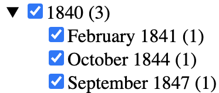
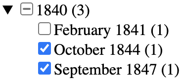

# Facets and fields in eXist-db
## Contents

  - [1. About facets and fields](#1-about-facets-and-fields)
  - [2. Facets](#2-facets)
    - [2.1. Overview of faceted searching in the Ghost Hoax app](#21-overview-of-faceted-searching-in-the-ghost-hoax-app)
    - [2.2. Using facets to control a search](#22-using-facets-to-control-a-search)
    - [2.3. Configuring facets](#23-configuring-facets)
    - [2.4. Counting with facets](#24-counting-with-facets)
    - [2.5. Computed values](#25-computed-values)
    - [2.6. Hierarchical facets](#26-hierarchical-facets)
    - [2.7. Using facets to constrain a query](#27-using-facets-to-constrain-a-query)
    - [2.8. Facets and boolean queries](#28-facets-and-boolean-queries)
    - [2.9. Querying on hierarchical facets](#29-querying-on-hierarchical-facets)
    - [2.10. Facets conclusion](#210-facets-conclusion)
  - [3. Fields](#3-fields)
    - [3.1. Configuring fields](#31-configuring-fields)
    - [3.2. Returning field values in a query](#32-returning-field-values-in-a-query)
    - [3.3. Fields](#33-fields)

----
## 1. About facets and fields

*Facets* and *fields* are part of the *full-text indexing* feature of eXist-db. As the name implies, full-text indexing provides a mechanism for retrieving documents according to any of the words they contain, e.g., “Find all documents that contain the word ‘ghost’” (anywhere in the document) or “Find all documents that contain the word ‘ghost’ in the title”, etc.

The description of facets and fields in [official eXist-db documentation for full-text indexing](http://exist-db.org/exist/apps/doc/lucene.xml?field=all&id=D3.15.73#D3.15.73) provides a clear overview of these features, but in some places without as much detail as we would like. The purpose of this document is to explain why and how to use facets and fields in an eXist-db app, with examples drawn from our [Ghost Hoax app](https://github.com/Pittsburgh-NEH-Institute/pr-app), which is designed to explore a collection of Victorian-era newspaper articles about ghost hoaxes.

The difference between facets and fields is described clearly in Alex Kennedy’s [The definitive guide to the difference between filters and facets](https://www.search.io/blog/the-difference-between-filters-and-facets) (text in square brackets is our own):

> Both exist to serve the same purpose: narrowing down search results by eliminating results or pages that don’t match selected criteria […] For clarity’s sake, we’re going to define them as follows: *filters* [that is, *fields*] exclude results based on **initial criteria and do not change with each search**, while *facets* exclude using the **properties from returned results and do change with each search**.

This tutorial makes the following assumptions:

1. Readers who are not familiar with eXist-db full-text indexing must first read the documentation at <http://exist-db.org/exist/apps/doc/lucene>. 
2. Because facets and fields use maps and arrays, which were added to XPath only in version 3.1 (2017), users who are not familiar with those data structures must first read the Saxonica [Maps in XPath](https://www.saxonica.com/html/documentation11/expressions/xpath30maps.html) and [Arrays in XPath](https://www.saxonica.com/html/documentation11/expressions/xpath31arrays.html). More complete documentation is available in the [3.11 Maps and Arrays](https://www.saxonica.com/html/documentation11/expressions/xpath31arrays.html) section of the XPath 3.1 specification.

Both facets and fields can index on computed values (that is, values that do not appear literally in the source XML), which, for reasons described below, can improve response time during query and retrieval. The computation can use the standard XPath and XQuery function libraries, as well as user-defined functions. Below we describe first facets and then fields, including also information about how to import user-defined functions into an index file so that they can be used during configuration.

## 2. Facets

### 2.1. Overview of faceted searching in the Ghost Hoax app

The Ghost Hoax Advanced search interface exposes three search components: *text*, *publisher*, *date*. All three function equivalently to constrain (filter) the titles returned, and any of the three can be modified at any time to refine a previous search step. The Advanced search page looks like the following, and the panels then change in response to user selections and specifications:


1. **Text:** Text searching is case-insensitive. The simplest text search is a single word; more complex text specifications (e.g., phrases, wildcards, proximity) are also supported (see the [Lucene documentation](https://lucene.apache.org/core/4_10_4/queryparser/org/apache/lucene/queryparser/classic/package-summary.html#package_description) for details). 
2. **Publisher:** The name of the publisher, with definite and indefinite articles moved to end (e.g., “Times, The” instead of “The Times”.) Users interact with publisher values by means of a checklist.
3. **Date:** Hierarchical, with *decade* (e.g., "1800" for the 1800–09 decade) at the top level and *month-year* in human-readable form (e.g., “January 1804”) as second level. Users interact with date values by means of a checklist. 

The checkbox interface in the Ghost Hoax app supports the following operations:

1. Selecting a decade automatically selects (checks) all of its subcategories (month-year combinations).
2. Unchecking a decade automatically unselects (unchecks) all of its subcategories.
3. Checking all month-years in a decade automatically selects (checks) the decade.
4. Checking some but not all month-years in a decade displays a dash in the checkbox for the decade, indicating that the decade is partially selected.

The facets in the Ghost Host app have the following characteristics (see the images immediately below):

1. Categories (`publisher`, `date`) are multi-select, that is, multiple selections within a category form an `or` operation.
1. Combinations of facet categories (`text`, `publisher`, `date`) form an `and` operation.
1. The interface updates only when the **Search** button is pressed. Unlike some faceted search interfaces it does not update automatically on each check.
1. Each query retrieves the article titles selected by the checked facet values plus only those facets (with counts) that can be used to constrain or expand the results. 

 &nbsp;&nbsp;

The default behavior of eXist-db facets is only to “drill down”, that is, to narrow the results of a previous query. In the case of the Ghost Hoax app this is inconvenient because we also want to be able to expand a result. For example, if we select one publisher and one date and we then want to keep the date but add another publisher, under the default eXist-db behavior we would have to unselect the publisher we already chose in order to be able to see and check other publishers that published articles on our selected dates. The behavior we want is to be able to broaden our selection to include additional values for a facet without having to undo any prior selection, which means that we want to see all publishers who published on our selected dates, whether we selected them or not, and likewise for all dates associated with our publishers, both selected and not selected. 

In order to support both narrowing and expanding a search we perform three queries behind the scenes and combine the results. For all three queries, if a text value is specified, only articles that contain that text are selected.

1. **To create the list of matching articles:** Publisher and date facets are combined to select only articles that match the intersection of both publisher and date selections. For example, if we check only the 1830s and *The Weekly Times*, we select only the articles published in that decade in that paper. If no publishers have been checked, there is no filtering by publisher, and the same is true of dates. 
2. **To create new publisher facets:**  To return facet values, with counts, for publishers who match the text and date (that is, values we might use to narrow or expand the publisher selections for our query) we perform a query using a combination of text plus selected date facets, ignoring selected publisher facets. This makes it possible to broaden the search by selecting additional publishers. Publishers who did not publish anything with the specified text on the specified dates are not shown, and the counts shown for the publisher options include only articles that match any specified text and dates.
3. **To create new date facets:** Similarly, new date facets are returned according to a combination of text plus selected publisher facets.

----

**Note:** We chose to update only when the user pushes the Search button, and not on every checkbox event (which is more common in faceted search interfaces), to reduce the delay associated with multiple reloads. One side-effect of that decision is that it is possible to select facet values that return no results, e.g., one publisher and one date where the selected publisher did not publish anything on the selected date. In that situation the interface will show “No matching articles found” plus facet values that could, if selected, return results (publishers that match the dates chosen and vice versa).

----

### 2.2. Using facets to control a search

The [eXist-db documentation](http://exist-db.org/exist/apps/doc/lucene.xml?field=all&id=D3.15.73#facets-and-fields) writes that:

> A facet defines a concept or information item by which the indexed items can be grouped. Typical facets would be categories taken from some pre-defined taxonomy, languages, dates, places or names occurring in a text corpus. The goal is to enable users to “drill down” into a potentially large result set by selecting from a list of facets displayed to them. For example, if you shop for a laptop, you are often presented with a list of facets with which you may restrict your result by CPU type, memory or screen size etc. As you select facets, the result set will become smaller and smaller.
> 
> Facets are always pre-defined at indexing time, so the drill down is very fast. They are meant for refining other queries, the assumption always is that the user selects one or more facets from a list of facet values associated with the current query results.

Facets can be configured as hierarchical, about which the eXist-db documentation writes:

> Hierarchical facets may also hold multiple values, for example if we would like to associate our documents with a subject classification on various levels of granularity (say: science with math and physics as subcategories or humanities with art, sociology and history). This way we enable the user to drill down into broad humanities or science subject first and choose particular topics afterwards.

Facets in eXist-db provide quick and efficient access to counts and they support a relatively simple syntax for compound queries. Any query that uses facets can be rewritten without facets, but where appropriate facets are likely to have two types of advantages:

1. Queries that use facets may be more performative than an alternative query without facets.
2. The syntax of queries that use facets may be simpler than the syntax of alternative queries without facets.

We say more about those two advantages below

### 2.3. Configuring facets

The following eXist-db *collection.xconf* index file creates a simple facet for the publisher of our corpus documents:

```xml
<collection xmlns="http://exist-db.org/collection-config/1.0" xmlns:tei="http://www.tei-c.org/ns/1.0">
    <index xmlns:xs="http://www.w3.org/2001/XMLSchema">
        <!-- Configure lucene full text index -->
        <lucene>
            <analyzer class="org.apache.lucene.analysis.standard.StandardAnalyzer"/>
            <analyzer id="ws" class="org.apache.lucene.analysis.core.WhitespaceAnalyzer"/>
            <text qname="tei:body"/>
            <text qname="tei:placeName"/>
            <text qname="tei:TEI">
                <facet 
                    dimension="publisher" 
                    expression="descendant::tei:publicationStmt/tei:publisher"/>
            </text>
        </lucene>
    </index>
</collection>
```

The `<text>` elements in our index file instruct eXist-db to construct full-text indexes for `<body>`, `<placeName>`, and the root `<TEI>` element, and the `<facet>` child of the configuration for the `<TEI>` element says that `<TEI>` elements should be retrievable with a facet called `publisher` (the value of the `@dimension` attribute) that refers to the `<publisher>` child of the `<publicationStmt>` element (the value of the `@expression` attribute). (This is a simplified example. We describe below how, in our real app, we use a formatted version of the publisher name instead of the literal value from the XML. For example, *The Times* in the XML is also stored as “Times, The” in the eXist-db index.)

### 2.4. Counting with facets

When we run the following query against our corpus using the facet configuration above:

```xquery
xquery version "3.1";
declare namespace tei="http://www.tei-c.org/ns/1.0";
let $hits as element(tei:TEI)+ := 
    collection('/db/apps/pr-app/data/hoax_xml')/tei:TEI[ft:query(., 'ghost')]
let $facets := ft:facets($hits, "publisher")
return 
    <facet_test>{
        let $facet-elements := 
            map:for-each($facets, function($label, $count) {
                <facet>
                    <label>{$label}</label>
                    <count>{$count}</count>
            </facet>})
        for $facet-element in $facet-elements
        order by $facet-element/count descending,
            $facet-element/label
        return $facet-element
    }</facet_test>
```

it returns a list of all publishers of documents that contain the string `"ghost"` with the number of times a document by each publisher occurs in the results *even though we do not perform any explicit counting in our XQuery code*. The output is sorted in descending order by frequency, and then subsorted alphabetically by publisher name:

```xml
<facet_test>
    <facet>
        <label>The Times</label>
        <count>8</count>
    </facet>
    <facet>
        <label>The Leader</label>
        <count>3</count>
    </facet>
    <!-- some results removed -->
    <facet>
        <label>The Weekly Times</label>
        <count>2</count>
    </facet>
    <facet>
        <label>Weekly True Sun</label>
        <count>1</count>
    </facet>
    <facet>
        <label>Yankee Notions</label>
        <count>1</count>
    </facet>
</facet_test>
```

We could have written the following regular FLWOR expression to return essentially the same results:

```xquery
xquery version "3.1";
declare namespace tei="http://www.tei-c.org/ns/1.0";
let $hits as element(tei:TEI)+ := 
    collection('/db/apps/pr-app/data/hoax_xml')/tei:TEI[ft:query(., 'ghost')]
return 
    <facet_test>{
        for $hit in $hits
        group by $publisher := $hit//tei:publicationStmt/tei:publisher[1]
        let $count := count($hit)
        order by $count descending, $publisher
        return <facet>
            <label>{$publisher ! string(.)}</label>
            <count>{$count}</count>
        </facet>
    }</facet_test>
```

One reason to prefer facets over the regular XQuery FLWOR strategy is that with facets the counts are computed at index time, while with FLWOR they are computed at query time. With a small amount of data the difference will not be noticeable, but counting at index time can provide a substantial improvement in performance because 1) the counting is performed only once (instead of being repeated for each query) and 2) performance is typically a higher priority at query time than during indexing.

----

**Note:** XQuery FLWOR expressions since version 3.0 support a <code>count</code> clause that can be used for counting members of a group, but that feature is not supported by eXist-db (as of version 6.0.1, the latest stable release as we write this tutorial in May 2022).

----

Here’s how retrieving facets with counts works:

We can ask about facets in our XQuery only if we first perform a full-text query using `ft:query()`. In the XPath expression above we select all documents in our corpus and then use the `ft:query()` function to filter them to keep only those that contain the word `"ghost"` anywhere inside the `<TEI>` root element. We bind the result of this query to a variable we call `$hits`.

----

**Note:** If we want to retrieve all documents without filtering on string content we can use an empty sequence as the second argument to the `ft:query()` function instead of an explicit string, e.g.:

```xquery
collection('/db/apps/pr-app/data/hoax_xml')/tei:TEI[ft:query(., ())]
```

**Note:** Because of the way that eXist-db indexed retrieval works, we must specify the documents and the predicate in the same statement. For example, the XPath in the snippet below is informationally identical to that of the first version, above, and also easier to read because it uses <dfn>convenience variables</dfn>. Unfortunately, it will not quickly or reliably produce correct results in eXist-db because it selects the documents on one line and applies the predicate on a different line:

```xquery
(: bad code :)
let $articles as element(tei:TEI)+ := 
    collection('/db/apps/pr-app/data/hoax_xml')/tei:TEI
let $hits as element(tei:TEI)+ := 
    $articles[ft:query(., 'ghost')]
```

----

Once we have boundthe `<TEI>` elements in our corpus that contain the string `"ghost"` to the variable `$hits`, we then use the `ft:facets()` function to return the publisher names for those documents with a count of the number of matching articles by each publisher. Note that *we do no explicit counting in our FLWOR*; the counts are created at index time and are available without having to count at query time. The first argument to the function `ft:facets()` is the result of `ft:query()` (in this case the `$hits` variable), the second argument is the name of the facet, which we specified as the value of the `@dimension` attribute in the index file  (in this case the string `"publisher"`), and the third argument (which is optional) is the maximum number of results to return (we omit this argument to return all results).

The `ft:facets()` function returns a *map*, which is a structure that contains *key:value* pairs. In this case the *keys* are the string values of each unique `<publisher>` element in the corpus and the associated *values* in the map are the numbers of documents for each  publisher. Maps cannot easily be serialized (rendered, printed) directly, and we want to convert the map structure into XML anyway. Furthermore, the entries in the map returned by `ft:facets()` are automatically sorted from highest to lowest counts, which is part of what we want, but the keys with the same count come back in an unpredictable order, and we want to alphabetize them in our output, which means that we need to sort them ourselves. We address these requirements by converting the map to a sequence of XML elements and then sorting the elements, as follows:

1. In our example above we use the `map:for-each()` function to loop over the *key: value* pairs.
2. For each *key: value* pair, we bind the key (the name of the publisher) to the variable name `$label` and the value (the number of times that publisher appears in the collection of documents represented by `$hits`) to the variable name `$count`. 
3. We create an XML `<facet>` element (you can call it whatever you want) with two children and write the label and count values into the children.
4. We bind that sequence of `<facet>` elements to a variable called `$facet-elements` and use a FLWOR to traverse over the values (`for`), sort them the way we want (`order by`), and return them in the new order.

### 2.5. Computed values

The facet example above uses the string value of the `<publisher>` element as it appears in the XML source files, but we actually want to sort and render the publisher names in a list with definite and indefinite articles moved to the end. For example, we want a publisher name like *The Weekly Times* to be sorted and rendered as “Weekly Times, The”. Facets let us perform that string surgery at index time, instead of query time, which means that we perform it only once, and at a time when performance speed is less important.

We can use an inline XPath expression to create a computed facet value, but the XPath to perform the operation we want is long enough that inlining it would make our index file difficult to read, and we also need to use the same function elsewhere in our app and we don’t want to have to write it out more than once. For that reason we create the function in a separate function library, which we then import into our *collection.xconf* index file. The function that moves the definite and indefinite articles around is:

```xquery
declare function hoax:format-title($title as xs:string) as xs:string {
    if (matches($title, '^(The|An|A) '))
        then replace($title, '^(The|An|A)( )(.+)', '$3, $1')
            ! concat(upper-case(substring(., 1, 1)), substring(., 2))
        else $title
};
```

This matches a leading definite or indefinite article and moves it to the end after appending a comma and a space. Because we have titles like “A ghost, a bear, or a devil” we also need to ensure that the first character of the title will be capitalized after the rearrangement.

This function is part of a function library located at *modules/index-functions.xqm* inside our app. We import it into our index file with:

```xml
<module uri="http://obdurodon.org/hoax" prefix="hoax" at="modules/index-functions.xqm"/>
```

(the path is relative to the root directory of the app) and use it during indexing by changing our facet definition to:

```xml
<facet dimension="publisher"
    expression="descendant::tei:publicationStmt/tei:publisher 
    ! hoax:format-title(.)"/>
```

This says that the string that will be returned as the name of the facet with a dimension value of `"publisher"` will be constructed by applying our user-defined function to the name of the publisher as it appears in our source documents. After we retrieve and style our publisher facets that portion of our page looks like:


### 2.6. Hierarchical facets

The eXist-db facet documentation illustrates a hierarchical facet with an example that divides an ISO date (e.g., `1806-02-04`) into a hierarchy of year, then month, and then day. A user could filter first by years and then filter the results for a particular year by month, and then filter those results by day. Our requirements were more complex because we wanted to use a computed decade as our top-level date facet and a computed human-readable month + year as a second level. The rendered view, with one of the decade facets expanded, looks like:


Although we need to render our month + year combinations in human-readable form, we want to sort them in ISO order. For that reason we create a second-level facet (with decades as the first level) based on just the year and month of an ISO date (e.g., `1806-02`). That lets us group, count, retrieve, and sort our results, and we then convert the value to a human-readable form for rendering.

----

**Note:** A string like `1806-02` does not match a valid ISO date because it is missing the required day portion, which means that it is not acceptable input to the XPath `format-date()` function. At the same time, we want to group our documents for facet purposes by just year and month, so we don’t want to include the day in the facet value. We meet those requirements by using just the year and month (e.g., `1806-02`) portion of the date as the second-level facet value (so that all articles from the same month of the same year are grouped and counted together) and then appending `-01` to each value before passing it into `format-date()` with a picture string of `"[MNn] [Y]"` for rendering. Appending a fake day at render time maps the facet value onto a valid ISO date and our picture string then ignores the day component and outputs only the month and year.

----

The portion of our index file that constructs the date facets is:

```xml
<facet dimension="publication-date"
    expression="descendant::tei:publicationStmt/tei:date/@when
        ! (
            (substring(., 1, 3) || '0'), 
            substring(., 1, 7)
        )" hierarchical="yes"/>
```

Hierarchical facets are created by specifying the value of a `@hierarchical` attribute as `"yes"` and specifying a sequence of values for the `@expression` attribute. In this case our XPath expression will, for example, map a date like `1806-02-04` to the sequence `('1800', '1806-02')` The first value is the top-level facet, the decade, and the second will be transformed to `"February 1806"` for rendering.

The XQuery that returns the faceted results (before formatting to create human-friendly month-year values) looks like:

```xquery
let $publication-date-facets as map(*) := ft:facets($hits, "publication-date", ())
let $publication-date-elements := 
    map:for-each($publication-date-facets, function($decade, $count) {
        <m:decade>
            <m:label>{$decade}</m:label>
            <m:count>{$count}</m:count>
            <m:years>{
                let $year-facets as map(*) := ft:facets($hits, "publication-date", (), $decade)
                let $year-elements :=
                    map:for-each($year-facets, function($m-label, $m-count) {
                        <m:year>
                            <m:label>{$m-label}</m:label>
                            <m:count>{$m-count}</m:count>
                        </m:year>
                    })
                for $year-element in $year-elements
                order by $year-element
                return $year-element
            }</m:years>                    
    </m:decade>})
for $publication-date-element in $publication-date-elements
order by $publication-date-element/m:label
return $publication-date-element
```

This returns:

```xml
<m:decade>
    <m:label>1800</m:label>
    <m:count>8</m:count>
    <m:years>
        <m:year>
            <m:label>1804-01</m:label>
            <m:count>8</m:count>
        </m:year>
    </m:years>
</m:decade>
<m:decade>
    <m:label>1820</m:label>
    <m:count>2</m:count>
    <m:years>
        <m:year>
            <m:label>1825-01</m:label>
            <m:count>1</m:count>
        </m:year>
        <m:year>
            <m:label>1826-03</m:label>
            <m:count>1</m:count>
        </m:year>
    </m:years>
</m:decade>
<!-- some results removed -->
<m:decade>
    <m:label>1870</m:label>
    <m:count>1</m:count>
    <m:years>
        <m:year>
            <m:label>1875-07</m:label>
            <m:count>1</m:count>
        </m:year>
    </m:years>
</m:decade>
<m:decade>
    <m:label>1880</m:label>
    <m:count>1</m:count>
    <m:years>
        <m:year>
            <m:label>1889-05</m:label>
            <m:count>1</m:count>
        </m:year>
    </m:years>
</m:decade>
```

The decade beginning in 1810 is missing because there are no articles in the corpus from that decade. Facets never return keys for which the count is zero, so if we want to list all decades, including those with no articles, we need to anticipate and handle any missing values ourselves.

### 2.7. Using facets to constrain a query

When we retrieve the titles of all articles that contain the string “ghost” along with lists of publishers and dates with article counts, we can then select one or more of those publishers or dates and rerun the query to return only articles that match the publishers or dates that we have specified. To constrain a query by a facet values we need to specify the facet names and values as part of an `ft:query()` operation. For example, the following query selects all articles in the corpus that have `"Times, The"` or `"John Bull"` as the values of their `publisher` facets (10 of the 36 articles in the corpus satisfy this requirement):

```xquery
xquery version "3.1";
declare namespace tei="http://www.tei-c.org/ns/1.0";
let $publishers as xs:string* := ("Times, The", "John Bull")
let $options := map { 
    "facets": map { 
        "publisher": $publishers
    }
}
let $hits as element(tei:TEI)* := 
    collection('/db/apps/pr-app/data/hoax_xml')/tei:TEI[ft:query(., (), $options)]
return $hits
```

When facets are used to constrain a query they are specified as part of a third argument to the `ft:query()` function. That third argument is an XPath map that accepts as keys the strings `"facets"` and `"fields"`. Here we specify only facets, and the value associated with the `"facets"` key is another map, where the keys are the `@dimension` values of the facets we care about and the values are a sequence of facet values that we want to use to filter our results. Note that because we moved the definite and indefinite articles to the end of the string when we created the publisher facets, we have to make that same adjustment when we use the value for querying (e.g., we specify “Times, The” and not “The Times”).

### 2.8. Facets and boolean queries

Faceted searching supports `and` and `or` combinations in an intuitive and efficient way, as follows:

1. If we specify multiple values for a single dimension, they are treated as an `or` operation. For example, when we specify a sequence of two strings as our `publisher` facet  values above, eXist-db selects all documents by either of those publishers (either the first `or` the second).
2. If we specify more than one dimension, eXist-db performs an `and` operation on the dimensions. For example, if we specify both publisher and date values, eXist-db will select articles that satisfy both a) the condition of having been published by any of the specified publishers `and` b) the condition of having been published on any of the specified dates. It will not select articles by the specified publishers on non-specified dates or articles on the specified dates by non-specified publishers.

The follow example selects and returns information about articles published in one of two papers and in a specified decade: 

```xquery
xquery version "3.1";
declare namespace tei="http://www.tei-c.org/ns/1.0";
let $hits  as element(tei:TEI)+ := 
    collection('/db/apps/pr-app/data/hoax_xml')/tei:TEI[ft:query(
        ., 
        (),
        map {
            "facets": map {
                "publisher" : ("Times, The", "Penny Satirist, The"),
                "publication-date" : "1830"
            }
        })]
for $hit in $hits
let $title as element(tei:title) := $hit//tei:titleStmt/tei:title
let $publisher as element(tei:publisher) := $hit//tei:publicationStmt/tei:publisher
let $date as xs:string := $hit//tei:publicationStmt/tei:date/@when
    ! format-date(., '[MNn] [D], [Y]')
return
    <li>{string-join(($title, $publisher, $date), '; ')}</li>
```

That query returns:

```xml
<li>All the world...; The Penny Satirist; January 20, 1838</li>
<li>The Bermondsey Ghost; The Times; July 8, 1830</li>
<li>Police Column: Yesterday The Lord Mayor...; The Times; January 9, 1838</li>
<li>All the world...; The Penny Satirist; January 20, 1838</li>
```

----

**Note:** In the example above we incorporate a call to the XPath `format-date()` function in our XQuery. We illustrate below how to improve performance by using an eXist-db field to create the formatted date at index time, which avoids the processing overhead of running it (repeatedly) at query time.

----

### 2.9. Querying on hierarchical facets

We specified the publication date as a hierarchical facet, which requires special handing if we want to query on multiple values. For example, if we
change the value of the `publication-date` in the example above to `("1830", "1840")` eXist-db will raise an error, even though specifying a sequence of two strings as publishers was valid. The reason is that although multiple values for regular (non-hierarchical) facets can be specified as a sequence, multiple values of a hierarchical faced must instead be specified as an array. If we write `["1830", "1840"]` instead of `("1830", "1840")` (the square brackets construct an array; the parentheses construct a sequence), the query will succeed.

The reason for this special treatment is that querying on hierarchical facets requires specifying *all* levels of the hierarchy as a *sequence*. For example, to select the five articles published in January 1838 we cannot specify just `"1838-01"`; we need instead to specify a facet value of `("1830", "1838-01")`, which eXist-db will understand correctly as a single hierarchical value (the January 1838 subset of the set published in the 1830s decade). Because sequences when specifying hierarchical facets are used to combine hierarchical levels into a single compound value, different non-hierarchical values must be combined as an array. For example, to retrieve the six articles published in either January 1838 (five articles) or November 1852 (one article) we write:

```xquery
xquery version "3.1";
declare namespace tei="http://www.tei-c.org/ns/1.0";
let $hits  as element(tei:TEI)+ := 
    collection('/db/apps/pr-app/data/hoax_xml')/tei:TEI[ft:query(
        ., 
        (),
        map {
            "facets": map {
                "publication-date" : [("1830", "1838-01"), ("1850", "1852-11")]
            }
        })]
for $hit in $hits
let $title as element(tei:title) := $hit//tei:titleStmt/tei:title
let $publisher as element(tei:publisher) := $hit//tei:publicationStmt/tei:publisher
let $date as xs:string := $hit//tei:publicationStmt/tei:date/@when
    ! format-date(., '[MNn] [D], [Y]')
return
    <li>{string-join(($title, $publisher, $date), '; ')}</li>
```
----

**Note:** XPath automatically flattens nested sequences, so that, for example, `(("1830", "1838-01"), ("1850", "1852-11"))` would be understood (incorrectly, for our purposes) as `("1830", "1838-01", "1850", "1852-11")`. This four-item sequence will look like it is trying to select a single value in a four-level hierarchy; it is not an error, but it will not return results because the `publication-date` facet in our app has a different (two-level) structure. Arrays, unlike sequences, are not automatically flattened, so `[("1830", "1838-01"), ("1850", "1852-11")]` will be understood correctly as two two-item sequences.

----

### 2.10. Facets conclusion

The primary benefits of using facets are:

1. *Facets provide counts* of the number of matches for each distinct value and those counts are computed at index time. Obtaining these counts without facets requires counting at query time, which is less efficient.
2. *Facets provide intuitive support for compound queries.* This functionality, including indexed retrieval, can be implemented without facets by using range indexes and queries that are attentive to what eXist-db can and cannot optimize. Once we familiarized ourselves with using maps and arrays, though, we found the facet approach easier to understand and less prone to error.
3. *Facets provide intuitive support for hierarchical structures.* This functionality can also be implemented without facets, but the facet approach performs any string surgery (in this case isolating the year and month from the full ISO date) during indexing, instead of at query time. This means that it is performed only once, and in a context that is typically less time-critical than interactive search and retrieval.

## 3. Fields

The [eXist-db documentation](http://exist-db.org/exist/apps/doc/lucene.xml?field=all&id=D3.15.73#facets-and-fields) writes that:

> A field contains additional, searchable content attached to an indexed parent node. In many cases fields will contain constructed content which is not directly found in the indexed XML or requires costly computation. For example, determining publication dates or author names for a set of articles may require some pre-processing which may be too expensive at query time. A field allows you to pre-compute those information items at indexing time.
> 
> Fields can be queried in the same expression as the parent node, resulting in fast response times. Their content can optionally be stored to speed up display or sorting. Fields may also use a different analyzer than the parent node, which allows e.g. multiple languages to be handled separately.

The eXist-db documentation describes several contexts in which fields may be useful, and the one we focus on here is that fields, like facets, can hold precomputed values. In the Ghost Hoax app we want to render a full formatted date as part of the information for each article, along the lines of:


The newspaper titles can be retrieved verbatim from the XML sources, but the article title and date that we render do not appear literally in the source documents:

1. The article title may begin with a definite or indefinite article and we want to move those to the end, after an inserted comma and space, before sorting and rendering. For example, where the original title reads “A ghost, a bear, or a devil” we want to display “Ghost, a bear, or a devil, A”.
2. The date information is present only in ISO format. For example, a date of September 24, 1836 is represented in the XML as `1836-09-24`, and we need to apply the XPath `format-date()` function to create user-friendly output.

We choose fields, rather than facets, for this task because we don’t need to group and count by article titles or dates, we don’t need a hierarchy, and we don’t use these values to refine a query. All we need is to preconstruct string values and retrieve them (instead of computing them) at query time.
### 3.1. Configuring fields

The simplest way to configure a field is to add a `<field>` element to the index file, as in:

```xml
<collection xmlns="http://exist-db.org/collection-config/1.0" xmlns:tei="http://www.tei-c.org/ns/1.0">
  <index xmlns:xs="http://www.w3.org/2001/XMLSchema">
    <!-- Configure lucene full text index -->
    <lucene>
      <analyzer class="org.apache.lucene.analysis.standard.StandardAnalyzer"/>
      <analyzer id="ws" class="org.apache.lucene.analysis.core.WhitespaceAnalyzer"/>
      <module uri="http://obdurodon.org/hoax" prefix="hoax" at="modules/index-functions.xqm"/>
      <text qname="tei:body"/>
      <text qname="tei:placeName"/>
      <text qname="tei:TEI">
        <field name="formatted-title" 
            expression="descendant::tei:titleStmt/tei:title 
            ! hoax:format-title(.)"/>
        <field name="formatted-date" 
            expression="descendant::tei:publicationStmt/tei:date/@when
            ! xs:date(.)
            ! format-date(., '[MNn] [D], [Y]')"/>
        </text>
    </lucene>
  </index>
</collection>
```

1. The configuration of the `formatted-title` field above uses the `hoax:format-title()` function (which we employed to format publication titles in our facets) to create a field called `formatted-title` that removes a leading definite or indefinite article from the beginning of an article title and moves it to the end after a comma and a space. For example, if the article title is “A ghost, a bear, or a devil” the associated `formatted-title` field value would be “Ghost, a bear, or a devil, A”.
1. The configuration of the `formatted-date` field above uses the standard library functions `xs:date()` and `format-date()` to create a human-readable full date. For example, if the publication date is “1838-11-04” the associated `formatted-date` field value would be “November 4, 1838”.

We could perform these string operations at query time, but implementing them instead at indexing time means that they have to be performed only once and that the values are available on demand, without having to be generated afresh. 

### 3.2. Returning field values in a query

The following XQuery returns metadata about all articles in the collection, including the constructed formatted article title and human-readable formatted date:

```xquery
xquery version "3.1";
declare namespace tei="http://www.tei-c.org/ns/1.0";
declare namespace m="http://www.obdurodon.org/model";
declare variable $all-hits as element(tei:TEI)+ :=
    collection('/db/apps/pr-app/data/hoax_xml')/tei:TEI
    [ft:query(., (), map { "fields" : ("formatted-title", "formatted-date") })];
<m:articles>{
    for $hit in $all-hits
    let $id as xs:string := $hit/@xml:id ! string()
    let $title as xs:string := ft:field($hit, "formatted-title")
    let $publisher as xs:string+ := $hit/descendant::tei:publicationStmt/tei:publisher ! string()
    let $date as xs:string := ft:field($hit, "formatted-date")
    order by $title
    return
    <m:article>
        <m:id>{$id}</m:id>
        <m:title>{$title}</m:title>
        {
            for $p in $publisher
            return 
            <m:publisher>{$p}</m:publisher>
        }
        <m:date>{$date}</m:date>
    </m:article>
}</m:articles>
```

As was the case with facets, field information can be retrieved only from results returned by `ft:query()`. Just as facet information is then retrieved from a query with `ft:facets()`, where results of the `ft:query()` operation serve as the first parameter, field information is retrieved with `ft:field()` with the same first parameter. One important difference is that the facets to be retrieved do not have to have been specified in the original `ft:query()` but fields do, which is why we used:

```xquery
ft:query(., (), map { "fields" : "formatted-title" } )
```

Had we instead omitted the third argument and run just `ft:query(., ())`, eXist would not have had access to the field value.

The preceding query returns results like the following (excerpted):

```xml
<m:articles xmlns:m="http://www.obdurodon.org/model">
    <m:article>
        <m:id>GH-19CUK-18380120</m:id>
        <m:title>All the world...</m:title>
        <m:publisher>The Penny Satirist</m:publisher>
        <m:date>January 20, 1838</m:date>
    </m:article>
    <m:article>
        <m:id>GH-19CUK-18380120</m:id>
        <m:title>All the world...</m:title>
        <m:publisher>The Penny Satirist</m:publisher>
        <m:date>January 20, 1838</m:date>
    </m:article>
    <!-- some results removed-->
    <m:article>
        <m:id>GH-BRITP-18640514</m:id>
        <m:title>Science: A new Ghost</m:title>
        <m:publisher>The London Reader</m:publisher>
        <m:date>May 14, 1864</m:date>
    </m:article>
    <m:article>
        <m:id>GH-GNCCO-18750703</m:id>
        <m:title>Substantial Ghost Story, A</m:title>
        <m:publisher>The People’s Advocate</m:publisher>
        <m:publisher>Altrincham Guardian</m:publisher>
        <m:date>July 3, 1875</m:date>
    </m:article>
    <m:article>
        <m:id>GH-GNCCO-18410227</m:id>
        <m:title>Thoughts On Seeing Ghosts</m:title>
        <m:publisher>The Odd Fellow</m:publisher>
        <m:publisher>Yankee Notions</m:publisher>
        <m:date>February 27, 1841</m:date>
    </m:article>
    <m:article>
        <m:id>GH-19CUK-18320318</m:id>
        <m:title>Tom Paine's Ghost</m:title>
        <m:publisher>The Age</m:publisher>
        <m:date>March 18, 1832</m:date>
    </m:article>
</m:articles>
```

Because these results are used to create a list of articles that will be alphabetized by article title, the article titles are rendered with leading definite and indefinite articles moved to the end, but publication titles are returned without that modification. The publication titles were modified in the facets, since they had to be alphabetized there. 

### 3.3. Fields 

In our Ghost Hoax app we retrieve constructed values using fields as a strategy for improving the performance of our queries. We do not use field values as query parameters, an addition aspect of fields that is described in the standard [eXist-db documentation](http://exist-db.org/exist/apps/doc/lucene.xml?field=all&id=D3.15.73#query-fields).