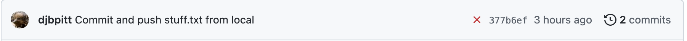
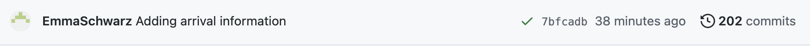
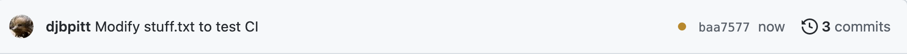

# Unit testing in XQuery with XQSuite

## Main modules and library modules

An eXist-db app typically entails a complicated set of inter-related XQuery modules (files that 
contain XQuery code) and other files, many of which depend on one another. There are two types of 
modules in XQuery:

* A *main module* has a query body (such as an XPath expression or a FLWOR) that can be
executed directly.
* A *library module* contains user-defined functions that can be imported into main modules.
A library module does not have a query body and cannot be executed directly.

In is possible to create user-defined functions inside a main module, but those functions are
then available only in that module. Since we often create user-defined functions that we want to
use in multiple main modules, we follow the common practice of writing most of our user-defined
functions inside a library module, which we then import into our main modules. 

----

**Note:** We do sometimes write local functions directly inside main modules, primarily when
we do not anticipate reusing them in other modules and when they are tightly connected to other
code in the main module. The most common example of this in our Ghost Hoax app involves local 
functions used by `typeswitch` expressions in the modules that create our views. 

----

## What is unit testing and how does it work?

If one of our main modules does not perform as expected, the mistakes may be located in any of several
different places. The rationale behind unit testing is that if we confirm that small units of 
functionality perform as expected, we improve the likelihood that larger modules that depend on those
small units will also operate correctly. In the Ghost Hoax app we regard each function in our function
library as a *testable unit*, and we create unit tests, then, to test the correctness of those 
individual functions independently of the main modules that import and apply them. To be sure, testing 
the functions in isolation cannot guarantee that our main modules will not contain bugs at a higher 
level, but testing individual functions in isolation at least makes it easier to find and fix mistakes  in those functions.

### What is a test suite?

Unit tests are typically run frequently and all at once, in what is known as a *test suite*. (The
unit testing framework that runs the tests is called a *test harness*.) We run tests frequently and
all at once because sometimes new code inadvertently breaks old code that had previously functioned
correctly, a development misadventure called a *regression*. Much as unit testing cannot catch 
mistakes at a level higher than the individual unit being tested (in our case, a function in our 
function library), unit testing cannot catch regressions at those higher levels. Even with that 
limitation, though, the more often we run the entire test suite the sooner we will learn about and be 
able to fix regressions that affect a specific function.

### How many tests is enough?

Unit testing can easily turn into quicksand, that is, an activity from which you can’t escape once you’ve stepped into it. A reasonable goal with respect to the extent of your unit testing is to test
all realistic (even if unlikely) types of input. One example we’ll introduce below involves a function
in our Ghost Hoax app that rearranges titles that begin with definite and indefinite articles, such as
changing “The Times” to “Times, The”. The tests for this function that we’ll illustrate below verify
correct behavior with input that begins with all three possible linguistic articles in an 
English-language text (“A”, “An”, “The”), as well as input that does not begin with an article. We 
also need to adjust the capitalization in titles like “A ghost, a bear, or a devil” to capitalize 
“ghost” when it becomes the first word of the title after we move the article, so we test for that, as 
well. So where should we stop writing tests? In this case we decided not to write tests for titles  that begin with the same letters as the linguistic articles but not with the articles themselves. For
example, we don’t test for “These Times” to ensure that it isn’t converted into “Se Times, The”. Our 
code would be more robust if we added tests for this type of mistake, and for others, but because we
were confident of our ability to tokenize the input on whitespace, this seemed a reasonable dividing 
point between thorough vs obsessive testing.

We write new tests whenever the following conditions arise:

1. When we create a new user-defined function, we write comprehensive tests for it, trying to 
anticipate all realistic types of input.
1. When we discover and fix a bug, we add a test that would have notified us of the bug. While in
some sense we’re adding this test too late, the emergence of the bug tells us that we failed to
anticipate all realistic input originally, and adding the test after the fact can help protect us from 
reintroducing the bug through a regression elsewhere in our code.

### How often should we run our test suite?

We run our test suite manually whenever we modify our function library, whenever we discover a bug
that we can trace to the function library, and whenever we add or modify a main module that imports
our function library. In a well-ordered universe we wouldn’t have to remember to run the test suite
manually, and Yeoman configures *continuous integration* (*CI*) that runs the entire test suite 
automatically whenever we push changes to our GitHub repo. As we write this in July 2022 the 
continuous integration for Yeoman v7.0.1 is broken, with the result that the CI will always report 
test failure even when we have no errors in our functions or our tests. The Yeoman developer is aware 
of the issue and will fix it at the next release. 

If you compare the small red “x” and the small green check mark in the first two images 
below, the “x” is what GitHub shows when tests run automatically by CI after a push fail, and the 
check mark is what it shows when they succeed. It can take a few minutes to run the test suite, during 
which time GitHub will display a small brown circle (third image below).







## Unit testing with XQSuite in eXist-db

The official eXist-db documentation for unit testing with XQSuite can be found at 
<https://exist-db.org/exist/apps/doc/xqsuite.xml>. In this tutorial we describe only a few of the
types of tests that eXist-db can support because those are the ones we find most useful in our own
work, including our Ghost Hoax app. The link above gives a more comprehensive description of support
for unit testing in eXist-db, including many additional types of tests.

XQSuite is not the only unit testing framework for XQuery, but we use it because it is well-supported 
by eXist-db and it meets our needs for our Ghost Hoax project. Developers who are already familiar
with using XSpec to test XSLT or Schematron can find information about testing XQuery with XSpec
at <https://github.com/xspec/xspec>. 

### Files for unit testing

Unit testing in an eXist-db app that has been initialized with Yeoman is located
in the *test/xqs* subdirectory. There are three files there:

* *test-runner.xq*: As the filename implies, this file runs your test suite. By default
it expects your tests to be located in a file called *test-suite.xqm* in the same directory
as the test runner. We recommend not editing this file and writing your tests in the *test-suite.xqm* 
file where it expects to find them.
* *test-suite.xqm*: Write your tests here. We describe below how to do that.
* *xqSuite.js*: You do not have to touch this file

As an alternative to writing all of our tests in a separate *test-suite.xqm* module, eXist-db also
makes it possible to write tests directly inside a library module, which is appealing because keeping 
the tests close to the code they are testing reduces the likelihood of inadvertently letting them get 
out of sync. We nonetheless write our tests in a separate *test-suite.xqm* module because some types
of unit tests are easier to write there than directly inside the library module, and we prefer to 
keep all of our tests in one place.

### Running the test suite

Running the test suite is as simple as executing the *test-runner.xq* module. One limitation is that
if your test suite needs to write into the database (as ours does; see below), you need to run the
tests with appropriate write permission. For that reason we find it simplest to run our tests in eXide 
after authenticating as userid `admin`. We set the eXide output type (in the drop-down in the output 
window) to “XML Output” because we find that the most legible option.

The output of a suite that runs ten tests, all successfully, looks like:

```xml
<testsuites>
    <testsuite package="http://www.obdurodon.org/apps/pr-app/tests" 
    	timestamp="2022-07-02T17:22:52.16-04:00" 
    	tests="10" failures="0" errors="0" pending="0" time="PT0.009S">
        <testcase name="construct-date-facets" class="tests:construct-date-facets"/>
        <testcase name="construct-date-facets" class="tests:construct-date-facets"/>
        <testcase name="get-lat" class="tests:get-lat"/>
        <testcase name="test-format-title" class="tests:test-format-title"/>
        <testcase name="test-format-title" class="tests:test-format-title"/>
        <testcase name="test-format-title" class="tests:test-format-title"/>
        <testcase name="test-format-title" class="tests:test-format-title"/>
        <testcase name="test-format-title" class="tests:test-format-title"/>
        <testcase name="test-round-geo" class="tests:test-round-geo"/>
        <testcase name="word-count" class="tests:word-count"/>
    </testsuite>
</testsuites>
```

When we deliberately create a failing test the output looks like:

```xml
<testsuites>
    <testsuite package="http://www.obdurodon.org/apps/pr-app/tests"
 		timestamp="2022-07-02T17:26:33.111-04:00" 
 		tests="11" failures="1" errors="0" pending="0" time="PT0.008S">
        <testcase name="construct-date-facets" class="tests:construct-date-facets"/>
        <testcase name="construct-date-facets" class="tests:construct-date-facets"/>
        <testcase name="fake-test-to-fail" class="tests:fake-test-to-fail">
            <failure message="assertEquals failed." type="failure-error-code-1">1</failure>
            <output>2</output>
        </testcase>
        <testcase name="get-lat" class="tests:get-lat"/>
        <testcase name="test-format-title" class="tests:test-format-title"/>
        <testcase name="test-format-title" class="tests:test-format-title"/>
        <testcase name="test-format-title" class="tests:test-format-title"/>
        <testcase name="test-format-title" class="tests:test-format-title"/>
        <testcase name="test-format-title" class="tests:test-format-title"/>
        <testcase name="test-round-geo" class="tests:test-round-geo"/>
        <testcase name="word-count" class="tests:word-count"/>
    </testsuite>
</testsuites>
```

## Test examples

Yeoman creates a skeletal *test-suite.xqm* file with the correct housekeeping code and a sample test,
so we can add our own tests there without having to remember how the file should be structured. The 
initial test suite skeleton for our app looks like:

```
xquery version "3.1";

module namespace tests = "http://www.obdurodon.org/apps/pr-app/tests";
declare namespace test="http://exist-db.org/xquery/xqsuite";

declare
    %test:name('one-is-one')
    %test:assertTrue
    function tests:tautology() {
        1 = 1
};

```

The module and namespace declarations are housekeeping and should not be touched. Your module 
declaration will differ because Yeoman adapts that line to repo-specific information. 

----

**Note:** As a reminder, namespaces are URIs (Uniform Resource *Identifiers*) and not URLs (Uniform
Resource *Locators*), which means that they are not links and they do not have to point to resources
on the web. The value of a project namespace is largely arbitrary.

----

The sample test looks like a regular function declaration except that it includes two test-related *assertions* (the lines that begin with `%test:`. If you ignore those lines for the moment, the 
function declaration starts with the `declare` keyword, then the `function` keyword, then the function 
name in the `tests:` namespaces declared earlier (`tests:tautology`)), and then the function body 
(inside curly braces). This function has no parameters (takes no input) and it returns the boolean 
value `True` because the equality test (`1 = 1`) succeeds and the assertion that reads
`%assertTrue` says that a `True` value is expected and should be considered correct.

### Housekeeping tasks

The tautology test does not test a function library, and before we write our own test for our own
user-defined functions we need to augment the housekeeping lines of the file as follows:

```
xquery version "3.1";

module namespace tests = "http://www.obdurodon.org/apps/pr-app/tests";
declare namespace test="http://exist-db.org/xquery/xqsuite";
import module namespace hoax="http://obdurodon.org/hoax" at "../../modules/functions.xqm";
declare namespace tei="http://www.tei-c.org/ns/1.0";
```

The two lines we add have the following purpose:

1. We import our function library, specifying its namespace and its location according to normal
XQuery `import` syntax. This is the same syntax that we use when we import our library into a main
module to make our user-defined functions available.
1. Because some of our user-defined functions expect input or produce output in the TEI namespace
we declare that namespace and bind it to the namespace prefix `tei:`.

### Simple tests

Our function library creates a function called `hoax:round-geo()`, which looks like:

```
declare function hoax:round-geo($input as xs:string) as xs:double {
    $input ! number(.) ! format-number(. , '#.00') ! number(.)
};
```

This function expect a string that looks like a double and returns a double rounded to two places
beyond the decimal point. For example, if the input is the string `'51.513979'` we expect it to return a double with the value `51.51`. The function works by casting the input to a number because it comes
in as a string and the standard `format-number()` function requires a number as its input. Since we
want to return a number and the `format-number(0` function returns a string, we cast it to a number
before we return it.

Our test for this function looks like:

```
declare
    %test:arg('input', '51.513979')
    %test:assertEquals(51.51)
    function tests:test-round-geo($input as xs:string) as xs:double {
        hoax:round-geo($input)
    };
```

When we test a function we specify as many `%test:arg()` assertions as there are function parameters, 
and those are mapped by name to the function arguments. Since our `hoax:round-geo()` function 
requires one parameter, called `input`, we include one `%test:arg()` assertion that specifies the
parameter name and the value we use for testing. Because `hoax:round-geo()` requires a string as its 
input, we put quotation marks around the input value. Our other assertion says that when given this
input the function should return an numerical value (note the absence of quotation marks) that is
equal to `51.51`. 

The body of our user-defined test must have a unique name in the `tests:` namespace. Our preference
is to prepend the string `test-` to the name of the user-defined function we are testing, but any
unique name is acceptable. Our test function says to take pass our input into our actual
`hoax:round-geo()` function, and the value returned is then tested against our assertion.

One limitation of XQSuite is that function arguments must be strings or numbers. We describe below
how to work around that limitation to test functions that require, for example, elements as their
input.

### Multiple tests

The example above is the only test we wrote for our `hoax:round-geo()` function, but we can also run
multiple tests against the same function, each with its own input (argument) and outcome assertions.
Here we test the function we describe above that moves the definite and indefinite article to the
end of a title (we don’t reproduce the function here, but you can examine it in the `modules/functions.xqm` file inside our Ghost Hoax app):

```
declare
    %test:arg('input', 'The Big Sleep')
    %test:assertEquals('Big Sleep, The')
    %test:arg('input', 'An Unusual Life')
    %test:assertEquals('Unusual Life, An')
    %test:arg('input', 'A Boring Life')
    %test:assertEquals('Boring Life, A')
    %test:arg('input', 'Andrea and Andrew')
    %test:assertEquals('Andrea and Andrew')
    %test:arg('input', 'A ghost, a bear, or a devil')
    %test:assertEquals('Ghost, a bear, or a devil, A')
    function tests:test-format-title($input as xs:string) as xs:string {
        hoax:format-title($input)
    };
```

This function takes a single argument, and each result assertion (in this case they are all equality
assertions) indicates the end of a single set of test input and result. That is, each `%test:arg()` value is expected to produce a result equal to the `%test:assertEquals()` that follows it immediately.

### A more complex example

**TODO: Errors in function and tests; code in repo is correct**

The examples above test functions that require just a single argument. A more complex function in
our Ghost Hoax app consolidates date-related user-selected values and requires multiple arguments.
Further more, either of both of those arguments can be the empty sequence.

Users can specify dates to filter articles by selecting either an entire decade or a combination of 
month+year. Decades look as expected (e.g., `'1820'`); month+year combinations look internally like 
`'1825-01'` (for January 1825). Our interface is designed so that when a user selects a decade, all of 
the month+year combinations within that decade are also automatically selected; this makes it easier
for the user to fine-tune the selection in the interface. Meanwhile, our date facet configuration is 
hierarchical (see our [Facets and fields tutorial](facets-and-fields.md)), which means that if we ask 
for all results in, say, the 1820s, we do not want also to ask, redundantly for all of the results in 
all of the month+year combinations in that decade. For example, if the user selects the decades 
`'1800'` and `'1810'` and the month+year combinations `'1800-01'` and `'1820-01'`, we want our query 
to ask for the two decades plus only the month+year combination that is not already subsumed by a 
decade. We want our function, then, to ingest two arguments (a sequence of decades and a sequence of 
month+year combinations) and return only the month+year combinations that do not fall within any of 
the decades. The result of the function will then be combined with the specified decades to form the
facet portion of the query.

That function that removes redundant month+year combinations looks like:

```
declare function hoax:construct-date-facets($decades as xs:string*, $month-years as xs:string*) as xs:string* {
    let $decade-starts as xs:string := 
        '^(' || $decades ! substring(., 1, 3) => string-join('|') || ')'
    return 
        if (empty($decades)) then $month-years
        else if (empty($month-years)) then () else  
        $month-years[not(matches(., $decade-starts))]
};
```

The user input may contain zero or more decades and zero or more month+year combinations. We first 
form the decade starts into a regular expression so that, for example, the decades `'1800'` and 
`'1810'` will produce a `$decade-starts` variable with the value `'180|181'`. We then run a three-way 
test:

1. If there are no decades, all month+year combinations are returned, since none of them is redundant.
2. If there are no month+year combinations, then we return an empty sequence, and our eventual date facet value will consist only of any specified decades.
3. If there are both decades and month+year combinations, we use the `$decade-starts` regular 
expression to keep only month+year combinations that do not match. In the example above, where the
user selects the decades `'1800'` and `'1810'` and the month+year combinations `'1800-01'` and 
`'1820-01'`, we return only `'1820-01`, since the other month+year combination, `1800-01`, matches
the regular expression `'180|181'`.

We need tests to cover different possible inputs (like the multiple tests for our function that 
formats titles, above) and we also have the following new complications:

* An argument that consists of a sequence can be specified in `%test:arg()` by listing all of the
sequence items after the argument name. For example `%test:arg('decades', '1800', 1810')` sets the
value of `$decades` to the sequence `('1800', '1810')`.
* Arguments can be empty, but because argument values in the test framework have to be atomic values,
although we can specify an empty string as a value inside `%test:arg()`, we cannot specify an empty
sequence. We therefore specify the empty string as a fake initial value (e.g., `%test:arg('decades', '')`) and then map it to an empty sequence inside the test function: `let $d as xs:string* := if ($decades[1] eq '') then () else $decades`
* The function returns a sequence, which we cannot test with `%test:assertEqual()`, so instead we use `%test:assertXPath()` with the `deep-equal()` function, which is able to test sequences.

The testing function below calls our `hoax:construct-date-facets()` three times, once with both decade and year+month values, once with only decade values, and once with only year+month values. More 
exhaustive testing


```
declare
    (: Remove month-years shadowed by decades :)
    %test:arg('decades', '1800', '1810')
    %test:arg('month-years', '1800-01', '1820-01')
    %test:assertXPath("deep-equal($result, ('1820-01'))")
    (: If no month-years, return empty :)
    %test:arg('decades', '1800', '1810')
    %test:arg('month-years', '')
    %test:assertXPath("deep-equal($result, ())")
    (: If no decades, return all month-years :)
    %test:arg('decades', '')
    %test:arg('month-years', '1800-01', '1820-01')
    %test:XPath("deep-equal($result, ('1810-01', '1820-01'))")
    function tests:construct-date-facets(
        $decades as xs:string*, 
        $month-years as xs:string*
    ) as xs:string* {
        let $d as xs:string* := if ($decades[1] eq '') then () else $decades
        let $m as xs:string* := if ($month-years[1] eq '') then () else $month-years
        return hoax:construct-date-facets($d, $m)
    };
```

### XML test input

Setup and teardown

## Function design and test driven development

Writing unit tests for individual functions makes sense in a context where each user-defined XQuery 
function is an isolatable unit of functionality. It is possible to write large functions that do
many things, but that makes them harder to test (and harder to develop and maintain in general). 
In our Ghost Hoax app we aim to isolate one repsonsibility in each function, and if we need a
function to return a complex result we let it call on other user-defined functions.

Test driven development is a development strategy that creates the tests before writing the functions
to which the tests apply. Those initial tests will fail because the functionality has not yet been
implemented, and the developer then develops the function so that it will pass the tests. We rarely 
apply test driven development in our own work because we find it more natural to write the function 
before the tests, but advocates of the method correctly point out that test driven development has the
advantage of ensuring that the developer both tests everything and does not write anything that cannot
be tested.

## Limitations to unit testing

Unit testing is only as good as the tests and the test coverage. It isn’t possible to test everything, 
so a test suite can never be complete, and the tests themselves are, after all, user-defined
functions, which means that they themselves can also have bugs. An important part of the “cannot test
everything” issue is that some coding errors reveal themselves only at a level higher than an 
individual function. Software development often combines unit testing with *integration testing* (to
verify that units interact correctly) and *end-to-end* testing (to verify the integrity of the system
at a higher level). Despite all of these limitations, we find that the effort of writing unit tests is
quickly repaid by more robust and maintainable code, and we rarely undertake a project of any 
appreciable size without writing unit tests for our functions. 

## Unit-testing humor

An example of how even with too many tests there can never be enough tests:

>A software QA engineer walks into a bar. He orders a beer. Orders 0 beers. Orders 99999999999 beers. Orders a lizard. Orders -1 beers. Orders a ueicbksjdhd.
>
>First real customer walks in and asks where the bathroom is. The bar bursts into flames, killing everyone.

(<https://www.reddit.com/r/Jokes/comments/a4a4jc/a_software_qa_engineer_walks_into_a_bar/>)